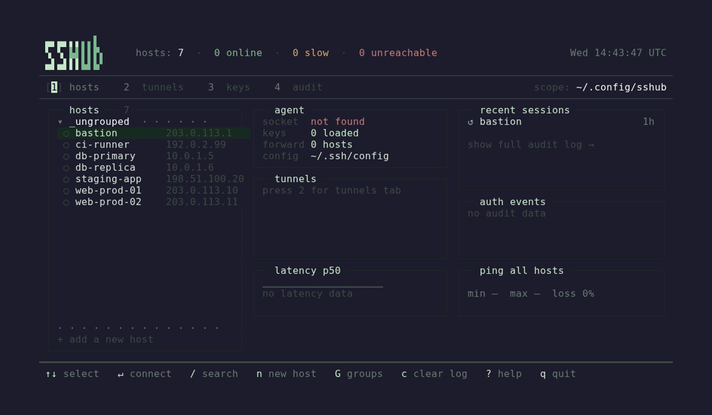
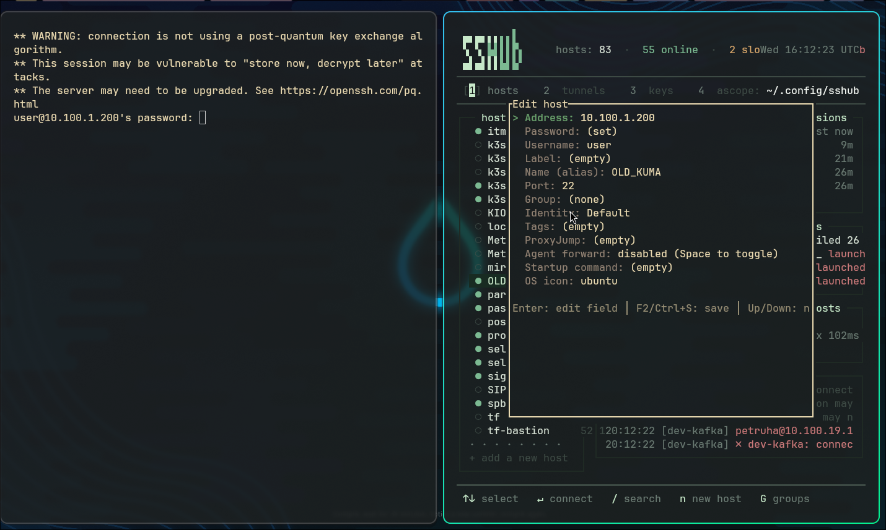

# SSHub

A terminal UI for managing and connecting to SSH hosts. Combines your `~/.ssh/config` with a built-in host database, tunnels, key management, and an audit log -- all in one keyboard-driven interface.

> ⚠️ This project is 100% vibe-coded slop made with dynamic workflows using Claude Opus 4.8. Use at your own risk.


<details>
<summary>More demos</summary>

Adding a managed host and marking it as a favorite:



Static screenshot:



</details>

## Features

- **Hosts** -- browse, search, and connect. Fuzzy search with `/`, tag filter with `#`, favorites, groups, manual sort order
- **Tunnels** -- define and manage SSH tunnels (local/remote/dynamic SOCKS). Start, stop, and monitor from the TUI
- **Keys** -- identity management with ssh-agent integration. Add/remove keys from agent, see loaded status
- **Audit** -- log of all connection events with filtering by status (ok/fail) and time range (today/week/month)
- **Hybrid sources** -- hosts from `~/.ssh/config` (read-only) and launcher-managed (full CRUD) merge without duplicates
- **Import/Export** -- import from `~/.ssh/config` or Termius backups; export managed hosts back to ssh config format
- **Hot reload** -- edits to `~/.ssh/config` update the host list live via file watcher
- **Mouse support** -- click tabs, select rows, scroll panels, double-click to connect
- **Terminal launchers** -- opens SSH sessions in kitty, ghostty, or a custom terminal command

## Install

Requires Rust toolchain (edition 2021) and `ssh` in `PATH`.

```bash
git clone https://github.com/Petyok/SSHub.git
cd SSHub
cargo build --release
```

The binary is at `target/release/sshub`. Copy it somewhere in your `PATH`:

```bash
cp target/release/sshub ~/.local/bin/
```

## Usage

```bash
sshub              # launch TUI
sshub --dry-run    # exit immediately (CI / scripts)
sshub --help       # show options
```

### Data paths

| Resource   | Default path                          |
|------------|---------------------------------------|
| Config     | `~/.config/sshub/config.toml`         |
| Database   | `~/.local/share/sshub/launcher.db`    |
| SSH config | `~/.ssh/config`                       |

Override via environment variables: `SSHUB_CONFIG_DIR`, `SSHUB_DATA_DIR`, `SSHUB_SSH_CONFIG`.

## Keybindings

### Global

| Key              | Action                          |
|------------------|---------------------------------|
| `1`..`4`         | Switch tab (hosts/tunnels/keys/audit) |
| `Tab`            | Toggle detail panel             |
| `Esc`            | Back / close overlay            |
| `?` / `Shift+H`  | Help screen                     |
| `q`              | Quit                            |

### Hosts (tab 1)

| Key                | Action                    |
|--------------------|---------------------------|
| `j`/`k` or arrows | Navigate                  |
| `Enter`            | Connect to host           |
| `a`                | Add host                  |
| `e`                | Edit host                 |
| `d`                | Delete host               |
| `D`                | Duplicate host            |
| `f`                | Toggle favorite           |
| `s`                | Cycle sort mode           |
| `/`                | Fuzzy search              |
| `#`                | Filter by tag             |
| `Shift+G`          | Manage groups             |
| `Shift+I`          | Import from ssh config    |
| `Shift+E`          | Export to ssh config      |
| `Shift+T`          | Import from Termius       |

### Tunnels (tab 2)

| Key       | Action              |
|-----------|----------------------|
| `a`       | Add tunnel           |
| `e`       | Edit tunnel          |
| `d`       | Delete tunnel        |
| `Enter`   | Start / stop tunnel  |
| `x`       | Kill tunnel process  |

### Keys (tab 3)

| Key        | Action                  |
|------------|--------------------------|
| `a`        | Add identity             |
| `e`        | Edit identity            |
| `d`        | Delete identity          |
| `r`        | Remove key from agent    |
| `Shift+A`  | Add key to agent         |

### Audit (tab 4)

| Key | Action                              |
|-----|--------------------------------------|
| `f` | Cycle filter (all / ok / fail)       |
| `r` | Cycle range (all / today / week / month) |

## Configuration

`~/.config/sshub/config.toml`:

```toml
[terminal]
# "kitty", "ghostty", or a custom command template
launcher = "kitty"
# custom_command = "alacritty -e ssh {host}"
```

## Development

```bash
cargo build            # debug build
cargo test             # unit tests
just test              # all tests (unit + smoke + e2e + config)
cargo clippy           # lint
cargo run -- --dry-run # quick sanity check
```

### Test levels

| Level    | Command                       | What it checks                       |
|----------|-------------------------------|--------------------------------------|
| Unit     | `cargo test`                  | Logic, parsers, fixtures -- no TTY   |
| Smoke    | `cargo test --test smoke`     | Binary starts, `--help`, `--dry-run` |
| E2E      | `cargo test --test e2e`       | TUI scenarios via TestBackend        |
| Config   | `cargo test --test config_load` | Config file creation and loading   |

### Environment variables

| Variable           | Purpose                                    |
|--------------------|--------------------------------------------|
| `SSHUB_CONFIG_DIR` | Override config directory                  |
| `SSHUB_DATA_DIR`   | Override data/SQLite directory             |
| `SSHUB_SSH_CONFIG`  | Override SSH config file path              |
| `SSHUB_DRY_RUN`    | Exit immediately without TUI              |
| `SSHUB_AUTO_QUIT`  | `1` = quit after first draw, `q` = send quit key |

## Tech stack

[Rust](https://www.rust-lang.org/) with [ratatui](https://ratatui.rs/) + [crossterm](https://github.com/crossterm-rs/crossterm) for the TUI, [rusqlite](https://github.com/rusqlite/rusqlite) (bundled SQLite) for storage, [nucleo](https://github.com/helix-editor/nucleo) for fuzzy search, [notify](https://github.com/notify-rs/notify) for file watching. No async runtime -- synchronous event loop with 50ms polling.

## License

[MIT](LICENSE)
