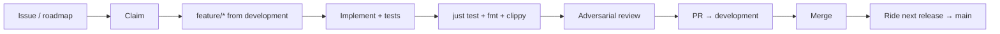

# Implementation flow

Canonical checklist for landing work in SSHub. Lives on **`development`** at [`docs/implementation-flow.md`](implementation-flow.md) — not on a feature branch. Humans and coding agents should follow this end-to-end.

**Related:** [CONTRIBUTING.md](../CONTRIBUTING.md) (basics), [CLAUDE.md](../CLAUDE.md) (versioning/releases), roadmap [#14](https://github.com/Petyok/SSHub/issues/14), code wiki [openwiki/quickstart.md](../openwiki/quickstart.md).

## Overview



## 1. Track work

| Step | Action |
|------|--------|
| Pick or open an issue | New features should appear on the [roadmap (#14)](https://github.com/Petyok/SSHub/issues/14). Open an issue if none exists; maintainer triages it into the roadmap. |
| Claim before coding | Assign yourself or comment that you are taking it. Unclaimed roadmap items are assumed free ([CONTRIBUTING.md](../CONTRIBUTING.md)). |
| GitHub comments (AI) | **Required:** every issue/PR comment ends with `_Written by {Model} ({Platform}) on behalf of the maintainer._` (see [§ GitHub comments](#github-comments-ai-agents)). |
| Link PR to issue | PR body must include `Closes #N` so the issue and roadmap checkbox update on merge. |

### GitHub comments (AI agents)

If **you** (a coding agent) post on GitHub — issue claims, status updates, PR reviews, triage — you **must** sign the comment. No anonymous agent comments. No inline-only model mentions.

**Always** end the comment with this exact form (model and platform filled in):

```text
_Written by {Model} ({Platform}) on behalf of the maintainer._
```

Examples:

```text
Taking this — working on `feature/session-logging`.

_Written by Composer (Cursor) on behalf of the maintainer._
```

```text
_Written by Claude Opus 4.8 (Claude Code) on behalf of the maintainer._
```

- **Model** must be specific — `Claude Opus 4.8`, `Claude Fable 5`, `Composer`, `GPT-5.4`, not “AI” or “Claude” alone.
- **Platform** is the tool or runtime — `Cursor`, `Claude Code`, `Codex`, etc.
- Put the signature on its **own line** at the **end** of every agent comment, including one-line claims.

Reference: issue [#4](https://github.com/Petyok/SSHub/issues/4).

Human contributors do not need a signature.

## 2. Branch

```bash
git fetch origin
git checkout development
git pull origin development
git checkout -b feature/short-description
```

- **Base:** always `development`, never `main`.
- **Name:** `feature/*` for features; `fix/*` for bugfixes is fine.
- **Do not** bump `Cargo.toml` version on the feature branch — versioning is automated on `development` and at release.

## 3. Implement

- Keep PRs focused: one feature or fix per PR.
- Prefer small, logical commits on the feature branch.
- Update docs when behaviour changes:
  - `CHANGELOG.md` under `[Unreleased]` for user-visible changes
  - `README.md` and in-app help (`src/tui/screens/help.rs`) when UX or keybindings change
  - `openwiki/` when architecture or operational behaviour changes (see below)
- Match existing code patterns; no drive-by refactors.

## 4. Verify (required before PR)

**Always run lints locally** — CI will fail if you skip this. Agents must run these commands in the workspace before every push, not only before opening the PR.

```bash
just test
cargo fmt
cargo fmt --check
cargo clippy --all-targets
```

All must pass. `cargo fmt --check` is what CI runs (not `fmt` alone — run both: `fmt` fixes, `--check` confirms). CI runs the same test suite plus `cargo fmt --check` and `cargo clippy --all-targets` on Ubuntu and macOS.

**Tests:** use fixtures and `tempfile`; never touch real `~/.ssh`, keyring, or user config dirs. See [CONTRIBUTING.md § Tests](../CONTRIBUTING.md#tests).

## 5. Security review (when applicable)

If the change touches **auth, credentials, file I/O, network calls, env vars, secrets, user input, or file permissions**, run a structured security review before opening the PR. Call out security-sensitive changes explicitly in the PR description.

## 6. OpenWiki (when applicable)

If you add or change `openwiki/` pages (or merge an OpenWiki bot PR):

1. Validate against `src/` — use the checklist in [openwiki/INSTRUCTIONS.md](../openwiki/INSTRUCTIONS.md).
2. Update [openwiki/.last-update.json](../openwiki/.last-update.json) (`gitHead`, `validatedAt`) after manual correction.
3. Keep `CLAUDE.md` / `AGENTS.md` architecture pointers in sync (prefer linking to OpenWiki over duplicating tables).

Automated regen is a starting point, not source of truth. Scheduled workflow needs repo secret `OPENROUTER_API_KEY` ([runbook](../openwiki/operations/runbook.md)).

## 7. Adversarial review (before merge)

After implementation is green locally, run an **independent adversarial multimodel review** on the diff (implementation agents must not skip this):

- Reconstruct task + acceptance criteria.
- Verify findings against code and test output — do not trust critic summaries blindly.
- Fix **verified** blockers and high-severity issues before merge.
- Verdict must be `SAFE TO COMMIT` or equivalent with no open blockers.

This catches doc drift, wrong API names, regressions, and scope creep that unit tests miss.

## 8. Open pull request

| Field | Rule |
|-------|------|
| **Target** | `development` only |
| **Title** | Conventional commits: `feat:`, `fix:`, `docs:`, `refactor:`, `test:`, `chore:` |
| **Body** | What changed and why; how you tested; `Closes #N`; security notes if relevant |
| **Scope** | One logical change set |

Example test plan bullets:

- [ ] `just test` green
- [ ] `cargo fmt` / `clippy` clean
- [ ] Adversarial review passed
- [ ] Manual smoke (if TUI behaviour changed)

## 9. After merge

- GitHub deletes the head branch automatically (keep “Delete branch” checked).
- Issue closes; roadmap checkbox on #14 ticks when `Closes #N` matched.
- Work rides the next release to `main` via `just release` (maintainer). See [CLAUDE.md § Versioning](../CLAUDE.md#versioning-vxyz).

## Quick reference

| Question | Answer |
|----------|--------|
| Where do PRs go? | `development` |
| Where do releases go? | `main` (tags `vX.Y.Z`) |
| Full test command? | `just test` |
| Roadmap? | [Issue #14](https://github.com/Petyok/SSHub/issues/14) |
| Architecture docs? | [openwiki/quickstart.md](../openwiki/quickstart.md) |
| Agent workflow rules? | [CLAUDE.md](../CLAUDE.md), [AGENTS.md](../AGENTS.md) |
