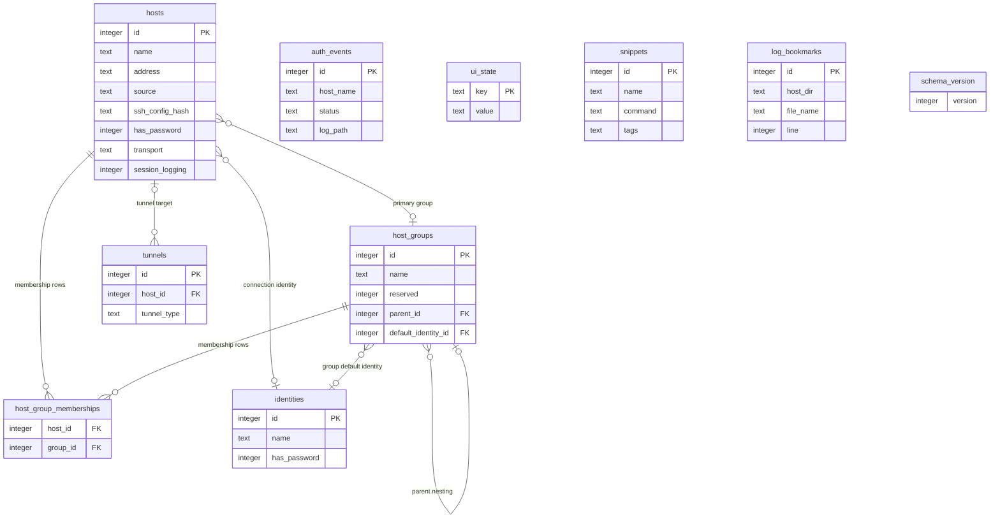

# Data Model & Storage

## Profile-owned storage

Normal installs keep `state.toml` at the data root and put each profile under
`profiles/<name>/`. A profile owns its two SQLite databases, `config.toml`, the
`themes/` directory, fallback credentials, session logs, and tunnel PID state:

```text
~/.local/share/sshub/
├── state.toml              # known profiles + last used (atomic tmp+rename, 0600)
└── profiles/<name>/
    ├── launcher.db
    ├── metadata.db
    ├── config.toml
    ├── themes/             # user theme files, beside the profile's config.toml
    ├── credentials.json    # fallback when the OS keyring is unavailable
    ├── logs/
    └── tunnels/
```

`ProfilePaths` (`src/profile/mod.rs`) is resolved once before resource
construction and passed down — stores, config, resolver, credentials, logging,
tunnels, watcher, and CLI context never rediscover paths from the environment.
Profiles retain stable ids so renaming does not change credential namespaces.
Every profile directory and database file is hardened 0700/0600 via
`src/secure_fs.rs`.

Directory overrides (`SSHUB_DATA_DIR` or `SSHUB_CONFIG_DIR`, with the
`SSH_LAUNCHER_*` fallbacks) select compatibility mode: the override directories
are used verbatim, with no `profiles/` nesting, no `state.toml`, and an empty
credential prefix so existing installs keep their keyring keys.

## Two SQLite databases

| DB | Path | Contents |
|---|---|---|
| `launcher.db` | `profiles/<name>/launcher.db` | Managed hosts, host groups, identities, tunnels, auth events (audit), snippets, log bookmarks, UI state |
| `metadata.db` | `profiles/<name>/metadata.db` | `host_metadata` for **legacy** ssh_config-only aliases: tags, description, environment, favorite, last_connected, session_logging, transport |

The split is historical: `metadata.db` predates the launcher database and still
backs per-alias metadata for hosts that exist only in `~/.ssh/config`.
`LauncherStore`'s own docs admit the "MVP still uses MetadataDb" — treat the
overlap (e.g. `session_logging` and `transport` exist on both `ManagedHost` and
`HostMetadata`) as an acknowledged incomplete migration, not a design to copy.

When a fresh `launcher.db` is created (`schema_version` = 0), a best-effort
one-way import copies legacy `host_metadata` rows into `hosts` as
`source=ssh_config` rows (`src/store/migrate.rs`). It is deliberately tolerant:
a corrupt or locked legacy DB is skipped with a warning instead of aborting the
migration (which would roll back the schema and brick every later launch), and
a single corrupt tags blob degrades to no tags.

## launcher.db schema (`src/store/`)

`LauncherStore` wraps a `Mutex<Connection>` (rusqlite, bundled SQLite) with
`PRAGMA foreign_keys=ON` and `busy_timeout=5000`, seeds a "Default" identity,
and restricts the DB file and any `-wal`/`-shm` sidecars to owner-only.

Migrations use a custom `schema_version` table — base v2 schema plus stepwise
`migrate_vN_to_vN+1` functions up to **SCHEMA_VERSION 15**, all in one
transaction; column adds are guarded with `pragma_table_info` so re-runs are
safe. The two newest steps:

- **v13 → v14** — creates `snippets` (the command-snippet library).
- **v14 → v15** — creates `log_bookmarks`, keyed by `host_dir` + `file_name` +
  `line` rather than a host row id, so a bookmark survives deleting and
  re-adding the host. A migration test pins the #118/#123 merge order: a v13
  database jumping straight to v15 in one launch must run *both* new steps.

### Table inventory

- `hosts` — managed hosts plus imported ssh_config rows; key columns: `source`
  (`launcher` | `ssh_config`), `ssh_config_hash` (drift detection),
  `transport` (ssh/mosh), `session_logging`, `environment`, `username`,
  `has_password`, `os_icon`.
- `host_groups` — nested via `parent_id`, may name a `default_identity_id`; a
  `reserved` flag marks the built-in **Favorites** group.
- `host_group_memberships` — M:N join table; a host can belong to several
  groups at once (the authoritative source; `hosts.group_id` is the kept,
  synced primary group).
- `identities` — seeded with a "Default" identity.
- `tunnels` — tunnel definitions (see [tunnels](../workflows/tunnels.md)).
- `auth_events` — the audit log (`host_name`, `username`, `via`, `status`,
  `note`), including the `log_path` column for session-connect events when
  logging is enabled.
- `ui_state` — key/value store for UI state: `collapsed_groups` (JSON array of
  group ids), `ui_zoom` (with a legacy `name_zoom` fallback), and
  `sftp_show_hidden`.
- `snippets` — reusable command snippets (name, command, description, JSON
  tags); no host linkage, ordered by name.
- `log_bookmarks` — named jump-points into session log segments (`host_dir`,
  `file_name`, `line`, `name`), newest first.
- `schema_version` — the single-row migration marker.



*Entity relationships and key columns of `launcher.db` at SCHEMA_VERSION 15; `auth_events`, `ui_state`, `snippets`, `log_bookmarks`, and `schema_version` are standalone tables (`auth_events` references hosts only by name string).*

### Favorites, and writes that look like ssh options

The reserved Favorites group cannot be renamed (a rename is a silent no-op) or
deleted. The migration that creates it never repurposes a user's pre-existing
group named "Favorites": if the name is taken, the reserved group is created
under a distinct name and found by the `reserved` flag. Runtime lookups are
flag-based: `favorites_group_id` selects `WHERE reserved = 1`, and the
connection-scoped helper additionally requires `name = 'Favorites'`. Membership
in Favorites is the source of truth for the favourite status — reads derive
`favorite` from reserved memberships, and writes sync `hosts.favorite` into a
Favorites membership row.

`LauncherStore` refuses to store a `name`, `address`, or `username` starting
with `-` (`is_option_like` / `reject_option_like`, issue #101): ssh would parse
such a value as an option rather than a host, and addresses are written
verbatim from imports, so the write boundary is where a poisoned row is
rejected. `ssh::safe_ssh_target` remains the connect-time backstop, rewriting a
leading-dash target into the `ssh://` form OpenSSH refuses.

CRUD is split across `src/store/hosts.rs`, `identities.rs`, `tunnels.rs`,
`snippets.rs`, `log_bookmarks.rs`; DTOs (`ManagedHost`, `HostSource`, `Tunnel`,
`AuthEvent`, `Snippet`, `LogBookmark`, `NewHost`, …) live in
`src/store/types.rs`. Secrets are **never** in SQLite — only `has_password`
flags; actual secrets are in the OS keyring behind `NamespacedPasswordStore`,
which prefixes every key with `profile:<id>:` so identical host names in
different profiles never share an entry (empty prefix in compat mode; fallback
`credentials.json` when no keyring — see [secrets](../security/secrets.md)).

`sshub --profile NAME db purge --yes-i-am-stupid` deletes the selected
profile's `launcher.db` and its SQLite sidecars (`-wal`, `-shm`, `-journal`;
`src/lib.rs::purge_profile_database`) and refuses without the confirmation
flag. `~/.ssh/config` is untouched and imported hosts reappear on next launch;
keyring passwords are deliberately orphaned.

## Hybrid host model (`src/hosts/loader.rs`, `src/ssh/`)

`load_merged_hosts` produces the unified host list:

1. DB hosts with `source=launcher` (full CRUD).
2. DB hosts with `source=ssh_config` — rows synced from the user's ssh config
   by `sync_ssh_config_hosts` (`src/ssh/import.rs`): each existing row is
   re-resolved and updated only when the resolved `ssh_config_hash` differs,
   and a row that no longer resolves is left untouched. Launcher rows are
   never overwritten.
3. Remaining unresolved ssh_config aliases surface as
   `HostEntry::Legacy { host, meta }`, with metadata from `metadata.db`
   (defaults ensured first).

Resolution goes through the `HostResolver` trait; `SshConfigResolver`
(`src/ssh/resolver.rs`) parses `Host` aliases itself (excluding wildcards and
negated patterns, following `Include` directives depth-capped at 16) and shells
out to `ssh -F <cfg> -G <alias>` for effective options. The user's own
`~/.ssh/config` is never written — export renders launcher-native hosts to
`exported.conf` (in the profile's config directory; `config_dir()/exported.conf`
in compat mode) with an atomic write and `.bak` backup (`src/ssh/export.rs`),
and `conf_val` flattens CR/LF so a host field can't inject a `Host *` stanza.

Hosts, groups, favorites, and identities as user-facing concepts:
[domain/hosts-identities](../domain/hosts-identities.md).

## Configuration (`src/config.rs`)

The active file is the **profile's own** `config.toml` (created on first run;
in compat mode the config directory's `config.toml`). Sections:

- Legacy `terminal` and `launch_command` keys may still occur in older config
  files, but are silently ignored after the external-terminal launcher was
  removed in 0.10.0. Sessions run on the embedded PTY (`src/session/`,
  tui-term + vt100); see [integrations](../integrations/external-terminals.md).
- `[appearance]` — `active_theme` (theme id, default `default`),
  `transparent_sshub_background` and `transparent_session_background` (the two
  independent 0.14.0 transparency switches, both default off), plus
  `show_detail_panel`, `date_format`, `disable_animation` (reduced-motion),
  `confirm_quit`, `identity_columns`, and `os_logo`. The retired
  `opaque_background` key is ignored and **dropped on the next save** —
  recognized as a real key, not as a comment or a lookalike name, so a mention
  of it never triggers a rewrite.
- `[clipboard]` — `relay_from_pty` (default `true`) controls whether the
  visible embedded session relays OSC 52 clipboard writes to the hosting
  terminal.
- `[session_logging]` — `enabled` (default off), `max_file_bytes` (default
  10 MiB), `retention_files` (50).
- `[tunnel_reconnect]` — `max_attempts` (12, 0 = unlimited),
  `initial_delay_ms`, `max_delay_ms`, `stable_secs`, `jitter_ratio` (consumed
  by `config::tunnel_backoff_delay`; see [tunnels](../workflows/tunnels.md)).
- `[keybinds]` — user rebinds from the Ctrl+K editor (`src/keybinds.rs`),
  including the newer `logs_browser` (Shift+L), `snippets_manage` (Shift+S),
  and `session_snippets` (Ctrl+N) actions.
- `[ssh]` — `config_path` overrides the imported ssh_config source for this
  profile (`~` expanded). Resolution order: `SSHUB_SSH_CONFIG` /
  `SSH_LAUNCHER_SSH_CONFIG` env overrides, then `[ssh] config_path`, then
  `~/.ssh/config` (`profile::ssh_config_path_for_profile`).

`save_config` deep-merges through `toml_edit`, preserving user comments and
unknown keys (an unparseable existing file is treated as empty rather than
blocking the write), then writes atomically via a 0600 `.toml.tmp` file and
rename. Loading triggers one-shot migrations (keybind migrations and retired-key
cleanup) that persist through the same merge so they run exactly once.

### Every persist path writes the profile's own file

`App::config_target()` (`src/app/keys.rs`) returns the profile's
`config.toml`, and every config persist path — settings toggles, the keybind
editor, forms, and the theme picker's `Enter` — funnels through
`save_config_to`, which writes that target (or the global file in compat mode).
This is the 0.14.2 fix: the theme picker used to write
`appearance.active_theme` to the global `~/.config/sshub/config.toml`, so the
setting appeared to take and silently reverted on the next profile-mode start.

Env overrides: `SSHUB_CONFIG_DIR`, `SSHUB_DATA_DIR`, `SSHUB_SSH_CONFIG` (with
`SSH_LAUNCHER_*` legacy fallbacks), plus `SSHUB_DRY_RUN` / `SSHUB_AUTO_QUIT`
for headless runs. A staged-rename migration moves `~/.config/ssh-launcher` →
`~/.config/sshub` (and the data-directory equivalent) via a `.migrating`
sibling so a crash mid-copy can't freeze a partial config; symlinks are
refused outright during the copy.

## Theme storage (`src/theme/`)

User themes are `*.toml` files read from a `themes/` directory **beside the
profile's `config.toml`** in profile mode (`App::new_with_profile`), i.e.
`profiles/<name>/themes/`; in compat mode and for the headless
`sshub theme list|show` commands it is `~/.config/sshub/themes` (or
`$SSHUB_CONFIG_DIR/themes`, resolved read-only via `config_dir_path` so merely
listing themes never creates or migrates anything).

- A theme's **id is its file stem** (lowercase letters, digits, `-`, `_`);
  built-in ids are reserved and a user file squatting one stays listed as
  invalid instead of shadowing the built-in.
- The registry caps a file at **1 MiB** and reads at most **256** `*.toml`
  files; discovery is one level deep.
- Loading is deliberately infallible: `App::load_themes_from` degrades a
  broken themes directory to the embedded built-ins with a non-fatal notice,
  and the degraded manager keeps pointing at the failed directory so a reload
  after a repair works. A broken themes dir never blocks startup.
- A missing or invalid `appearance.active_theme` falls back to the embedded
  `default` theme; the configured id (`saved_id`) is preserved and
  `config.toml` is never rewritten, so repairing the theme file is enough to
  get the user's choice back.

The theme file format, picker, and CLI live in `docs/theme-system.md`.

## Change guidance

- Adding a column or table: bump `SCHEMA_VERSION`, add a `migrate_vN_to_vN+1`
  step wired into `run_migrations`, and prefer `pragma_table_info` guards.
  Tests open in-memory stores (`LauncherStore::open_in_memory`) and run all
  migrations from scratch; when a migration adds a table, add a rollback test
  (drop the table, set the version back, re-run) so multi-step jumps — a v13
  DB landing directly on v15 — are covered.
- In-memory tests point the launcher path into a temp dir so the legacy
  metadata import can't pick up a stray `./metadata.db` from the CWD.
<!-- openwiki: broken internal link [overview.md#file-watcher] heading anchor "file-watcher" does not exist in "overview.md". Fix the href or restore the target, then delete this comment. -->
- The [file watcher](overview.md#file-watcher) only reloads hosts; config.toml
  changes require restart.
