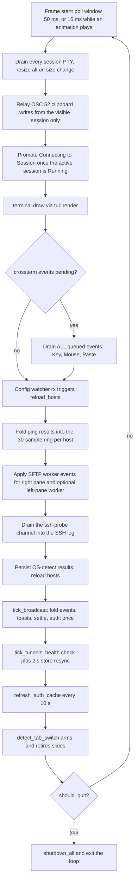

# Runtime Architecture

SSHub has **no async runtime** — no tokio, no futures; concurrency is background
threads talking over `std::sync::mpsc`. Startup first resolves one immutable
profile workspace in `src/profile/` (optionally running the standalone picker),
then builds `App` with that workspace. Everything after startup is driven by one
synchronous event loop in `src/lib.rs`
(`run()` → `run_with()` → `run_app_with()` → `run_terminal_loop()`).

## Startup (`src/lib.rs`)

```text
parse global flags -> terminal -> intro splash -> profile picker (if several)
  -> load profile config -> App::new_with_profile -> dashboard loop
```

- `run_with()` short-circuits to `Ok(())` when `SSHUB_DRY_RUN` (or the legacy
  `SSH_LAUNCHER_DRY_RUN`) is set; `--dry-run` on the binary path is handled in
  `src/main.rs` before the TUI is ever entered.
- The profile picker is a blocking terminal UI of its own: it runs only when
  `stdout().is_terminal()` and no `SSHUB_AUTO_QUIT` is set; headless invocations
  select the last-used profile silently. The picker plays the intro animation
  only when the last-used profile has not set `appearance.disable_animation`
  (`profile::picker_animation_enabled`).
- After `App::new_with_profile` resolves databases, config, themes, and workers,
  `attach_config_watcher` spawns the [file watcher](#file-watcher-srcwatcherrs).
  A watcher failure prints a warning and continues — hot reload is best-effort,
  never a startup blocker.
- **Headless**: when stdout is not a terminal, `run_headless_loop` renders one
  frame on a ratatui `TestBackend` (80×24) and then either applies
  `SSHUB_AUTO_QUIT` or bails with
  `sshub requires an interactive terminal (use --dry-run or SSHUB_AUTO_QUIT for
  CI smoke)`. `SSHUB_AUTO_QUIT=q` sends the `q` key, confirms the quit dialog if
  it appeared, and fails the run if `should_quit` was not set. Smoke tests drive
  exactly this path (`tests/smoke/run_app_quit.rs`) — see
  [testing strategy](../testing/strategy.md).

The terminal session (`setup_terminal`) enables raw mode, the alternate screen,
mouse capture, and bracketed paste (so a paste arrives as one `Event::Paste`
blob instead of per-key events). A `TerminalGuard` restores all of it on drop,
and an installed panic hook disables raw mode *before* delegating to the default
panic hook, so a panic never leaves the terminal wedged.

## One frame of the event loop (`src/lib.rs`)

`POLL_INTERVAL = 50ms`. Each iteration of `run_terminal_loop`:

1. **Size + session service** — read the terminal size; every open session is
   drained (`Session::drain`, feeding the vt100 parser, the optional session
   log, and the stderr debug tail) so background tabs accumulate output, and
   *all* sessions are resized when the host terminal changed size (every tab
   shares the same body area). Exited phases are logged once, connect-time
   diagnostics are drained into the SSH log, and a fresh connect clears that
   host's log first.
2. **OSC 52 relay** — `relay_visible_session_clipboard()` runs *before*
   diagnostics are collected so a failed relay reaches the log in this frame.
   Only the visible session may write the host clipboard; background tabs drop
   their requests immediately rather than queueing them.
3. **Promote `Connecting → Session`** — once the active session's phase is
   `Running` (first output), `app.mode` flips so Esc-cancel semantics change.
4. **Draw** — `terminal.draw(|frame| tui::render(frame, app))` (see
<!-- openwiki: broken internal link [#render-pipeline-src-tui] heading anchor "render-pipeline-src-tui" does not exist in /openwiki/architecture/overview.md. Fix the href or restore the target, then delete this comment. -->
   [render pipeline](#render-pipeline-src-tui)). Mouse capture stays on
   continuously so the scroll wheel always reaches sshub; native selection is
   the terminal's own Shift+drag override.
5. **Auto-quit check** — under `SSHUB_AUTO_QUIT` the loop renders once and
   exits via `apply_auto_quit`.
6. **Drain input + workers** — `poll_keys_and_watcher` (below).
7. **Quit** — if `app.should_quit`, `shutdown_all()` clears every embedded
   session (`Session::drop` kills the child process group and joins the reader
   threads) and the loop exits.



*One event-loop frame as implemented in `run_terminal_loop` + `poll_keys_and_watcher` (`src/lib.rs`): session drain → draw → input dispatch → worker drains → tick services → animation arming → quit check.*

### `poll_keys_and_watcher` — input and per-frame drains

The poll window is 50 ms at idle but **16 ms while `App::animating()` reports
any in-flight slide, morph, fade, or scroll chase** — the loop redraws at
~60 fps during motion and idles at ~20 fps otherwise. Then, in order:

- **Input**: when an event is ready, the loop drains *everything already
  queued* (`event::read` inside a zero-timeout poll loop): `Event::Key` →
  `app.handle_key`, `Event::Mouse` → `app.handle_mouse`, `Event::Paste` →
  `app.handle_paste`. The code notes the reason: one event per 50 ms frame
  makes pasting into an embedded session crawl at ~20 chars/sec.
- **Config watcher** (`watcher_rx`): collapse the burst into one
  `app.reload_hosts()` — the hot-reload feature.
- **Ping worker** (`ping_rx`): fold `PingResult`s into a per-host ring capped
  at 30 samples (`crate::ping::PING_UNREACHABLE` = `u32::MAX` is the sentinel;
  a trailing unreachable entry is cleared when the host recovers).
- **SFTP workers** (`sftp_rx`, `sftp_rx2`): events are collected first, then
  applied (`apply_sftp_event` / `apply_sftp_event_left`) because applying needs
  `&mut app`. The second pair exists only while the left pane browses another
  server.
- **SSH probe channel** (`probe_rx`): drained into `app.push_ssh_log`, but it
  is a **retired seam** — nothing sets `probe_rx` any more. The old 60-second
  `ssh -v` prober was removed because it buried the events users care about
  under hundreds of probe lines; the SSH log is now fed only by user-initiated
  events (connects, session exits, key pushes). Clearing the SSH log drops the
  receiver.
- **OS-detect worker** (`os_detect_rx`): collected then applied —
  `apply_os_detect` persists the detected `os_icon` and reloads hosts.
- **`tick_broadcast()`** — drives the live fleet run: drains worker events,
  folds them into the result table, spawns error toasts, arms the settle
  countdown when every row is terminal, and writes the audit trail exactly once
  (guarded by `audit_written`).
- **`tick_tunnels()`** — one-shot auto-connect bootstrap, health check
  (`TunnelManager::check_health` via `try_wait`, stabilizing spawns after
  `stable_secs`), keep-alive reconnect scheduling, and a **2-second resync**
  (`tunnels_synced`) that re-reads the tunnel list from the SQLite store because
  another sshub window or the CLI writes the same file.
- **Selection edge-autoscroll tick** for the active session's drag.
- **`refresh_auth_cache()`** — refreshes the audit cache every 10 s, preserving
  the audit tab's current filter/range instead of clobbering it.
- **`detect_tab_switch()`** — the animation arming step, deliberately **last**:
  it must run after the background drains so a mode change arriving from a
  worker event (e.g. an SFTP `ConnectFailed`) stamps `mode_entered_at` in the
  same tick — otherwise the next frame renders the popup at rest (a center
  flash) before the open slide starts. It compares per-tick mirrors
  (`anim_prev_tab`, `anim_prev_mode`, `anim_prev_audit`, …) against current
  state to arm tab-switch / popup / session slides, and retires finished ones,
  freeing their snapshot buffers.

## App state machine (`src/app/`)

`App` (`src/app/mod.rs`) holds all UI state plus injected dependencies
(`AppDeps`), which are the main test seams:

| Dep | Type | Production impl |
|---|---|---|
| `resolver` | `Box<dyn HostResolver>` | `SshConfigResolver` (`src/ssh/resolver.rs`) |
| `metadata` | `Arc<dyn MetadataStore>` | `MetadataDb` (`src/metadata/db.rs`) |
| `store` | `Arc<LauncherStore>` | SQLite `launcher.db` (`src/store/`) |
| `password_store` | `Box<dyn PasswordStore>` | `OsKeyring` behind `NamespacedPasswordStore`, falling back to a credentials file ([secrets](../security/secrets.md)) |

That is the whole struct — **exactly four fields**. The fifth dep the older
architecture had (`TerminalLauncher`) no longer exists: the external-terminal
subsystem and `src/launcher/` were deleted in 0.10.0, sessions run in the
embedded PTY (`src/session/`), and the CLI `sshub host connect` path spawns
ssh/mosh directly via `std::process::Command` (`src/cli/host.rs cmd_connect`).

- **Modes**: `AppMode` (`src/app/types.rs`) has **38 variants** — `Normal`,
  `Search`, `TagFilter`, `HostDetail`, `HostForm`, `IdentityForm`,
  `KeygenForm`, `GroupForm`/`GroupManage`/`GroupFieldPicker`, `TunnelForm`/
  `TunnelHostPicker`/`TunnelReconnectSettings`, `SessionPicker`,
  `PushKeyHostPicker`/`PushKeyIdentityPicker`, `FieldPicker`, `KeybindEditor`,
  `Settings`, `ThemePicker`, `ConfirmQuit`/`ConfirmDelete`/`ConfirmDiscard`,
  `Help`, `Palette`, `ImportPrompt`, `SftpPrompt`, `Connecting`, `Session`,
  `BroadcastPickTarget`/`BroadcastCommand`/`BroadcastPreview`, `Notice`,
  `KnownHosts`, `LogBrowser`, and the snippet trio
  `SnippetManage`/`SnippetForm`/`SnippetPicker`. Every overlay is a mode; key
  dispatch lives in `src/app/keys.rs` (`handle_key` matches `self.mode` to a
  per-mode handler, with `SessionPicker`/`SnippetPicker`/session modes routed
  early so the PTY keeps Ctrl+C), and per-mode handlers live in `src/app/*.rs`.
  `is_overlay_mode` treats everything except `Normal | Connecting | Session` as
  a popup, which is what the render pipeline's snapshot slides key off.
- **Tabs are not an enum**: `App.active_tab: usize` (0–4 = hosts, sftp,
  tunnels, identities, audit). Be careful when adding tabs — there is no type
  safety here; `render_tab_body` falls back to the hosts body for out-of-range
  indices, and `anim_prev_tab` lets `detect_tab_switch` notice tab changes made
  by the many code paths that assign `active_tab` directly.
- First run with no hosts drops straight into `Help` mode
  (`App::new_with_profile`).
- `App::new_with_deps` (the test constructor) uses built-in themes only, reads
  no config directory, and spawns **no workers** — the OS-detect worker is
  started only by the on-disk constructor `new_with_profile`, so
  dependency-injecting tests stay offline and never leak an ssh-probing thread.

### Runtime theme system

`App` privately owns a `ThemeManager` (`src/theme/manager.rs`); there is no
global mutable theme state. Renderers read `app.theme()`; the only two mutation
paths are `App::activate_resolved_theme` and `App::replace_theme_manager`, and
both run `invalidate_theme_visual_state()`, which drops every buffer snapshot
and in-flight slide captured under the old theme **before** the next frame —
otherwise the background passes (which select cells by colour) and the slide
blits would composite cells from two themes.

The fallback policy lives in `ThemeManager` alone: an unknown or unresolvable
`appearance.active_theme` degrades non-fatally to the embedded `default` theme,
keeps `saved_id` verbatim, and never rewrites `config.toml`, so repairing the
theme file is enough to get the user's choice back. `load_themes_from` is
deliberately infallible — a broken `themes/` directory yields built-ins plus a
one-line notice, never a failed startup.

The **ThemePicker** overlay (`AppMode::ThemePicker`, opened from Settings)
previews a theme on the whole UI on every navigation step
(`activate_resolved_theme`) but only `Enter` persists — activate, write
`config.toml` through the profile-aware writer, then `mark_saved()`, which
adopts the derived `active_id`. `Esc` restores the original (by id, falling
back to the `Rc` captured at open), and `r` reloads the themes directory,
replacing the registry and keeping a tombstone for rows that vanished.

Two transparency switches compose with this: `App::theme()` returns the
active theme **with its ground released** when
`appearance.transparent_sshub_background` is set, while
`App::base_theme()` (as authored) is what the remote PTY grid reads, so the
SSHub-surfaces switch and the session-grid switch stay independent.

The old fixed palette survives only under `#[cfg(test)]` (`src/tui/theme.rs`
`legacy`) as the witness for `default` parity proofs; productive code can only
obtain colours from `ResolvedTheme`. What stayed in `src/tui/theme.rs` is the
string→status-role mapping and the sparkline glyph ramp — logic, not colour.

## Render pipeline (`src/tui/`)

`tui::render` (`src/tui/mod.rs`) resolves a `FrameComposition` **once per frame
from a single clock reading** — the exit/enter slide offsets, the session-tab
slide progress, and every region that carries remote output (`protected`).
Those passes must agree about where a transition is, because the slide's blit
and the protection of what it blitted are one animation frame or they are a
bug. Then:

1. `render_inner` — the fullscreen session view whenever
   `session_is_rendered()` (which also counts the session and snippet pickers
   floated over a live session), otherwise the bento-grid dashboard chrome from
   `src/tui/dashboard_layout.rs`: header (wordmark, counting stats, session
   strip, clock), tab bar, three-column body, footer. Tab bodies are dispatched
   by `active_tab`; a zoomed panel (issue #18) takes over the body.
2. Session view extras: enter slide, tab slide, and the picker backdrops.
   Otherwise: the dashboard snapshot is refreshed (so entering a session has
   something to slide *over*), then the session-exit slide runs.
3. Popup machinery: `capture_popup_snapshot` records the popup drawn this frame
   (popups always draw at rest via `popup_open_rect`, which sets
   `app.last_popup_rect`); `render_popup_open` drops a fresh popup in from off
   the top of the screen (restoring the dashboard backdrop behind it) and
   `render_popup_close` throws a just-closed popup's snapshot upward — both
   over `POPUP_ANIM` (260 ms). Overlay→overlay transitions (e.g. a form
   bouncing to its discard-confirm on held Esc) replay neither.
4. `apply_app_background` — the three-pass background handling (below).
5. `apply_panel_selection` (reversed cells + text extraction for the zoomed
   panel) and the splash fade that lets the dashboard fade up out of the intro
   animation.

Overlay popups are dispatched on `app.mode` in a large match, each rendering
from `src/tui/screens/`. **Screens**: hosts body via widgets, sftp, tunnels,
keys, audit, help, palette, settings, keybind_editor, host_form, identity/keygen
forms, group_form, group_manage, field_picker, session_picker, push_key_pickers,
tag_filter, tunnel_reconnect, keychain, known_hosts, log_browser, snippet_form,
snippet_manage, snippet_picker, theme_picker, broadcast. **Widgets**
(`src/tui/widgets/`): header, footer, tab_bar, hosts_panel, host_list,
detail_panel, middle_stack (host card / agent / latency + SSH log panel),
right_stack (recent hosts, auth sparkline, ping), panel_box. `src/tui/layout.rs`'s
older `root_layout` is not referenced by the pipeline — only its own unit tests
use it.

`fit_popup` clamps popup rects with `desired.clamp(min.min(avail), avail)`
because a plain `u16::clamp` would assert `min <= max` and crash the whole TUI
on a terminal smaller than a popup's minimum.

### Three-pass background handling

SSHub is **opaque out of the box**; transparency is an explicit per-surface
choice (`appearance.transparent_sshub_background` for SSHub's own surfaces,
`appearance.transparent_session_background` for the remote grid). After all
widgets have drawn, `apply_app_background` fills the still-`Color::Reset` cells
in three deliberately separate passes:

1. **Theme app background** — a theme that resolved
   `components.app.background` to a real colour or gradient paints SSHub's own
   surfaces, excluding the protected PTY regions.
2. **PTY ground** (`apply_pty_ground`) — owns exactly those protected regions
   (the resting viewport plus the travelling bands of an exit or tab slide), backing
   the remote grid with the theme's `semantic.pty_background`/`pty_foreground`
   pair. Both channels are filled (foreground too), so reverse video and
   light-theme grounds cannot leak the emulator's own colour; each channel
   falls back on its own (canvas for the ground, plain text for the foreground)
   when a theme left it to the emulator. Skipped entirely under
   `transparent_session_background`.
3. **Canvas** — whatever is left is filled with `semantic.canvas`, for themes
   that resolved their ground to `"terminal"`. Skipped under
   `transparent_sshub_background`.

Every pass selects on `Color::Reset`, so none can touch a cell a widget already
coloured, and the exclusion of the protected regions is load-bearing: with
`transparent_session_background` on, pass 2 writes nothing and the canvas must
not land on the grid the user asked to see through.

### Animation: tween, blit, and reduced motion

- `src/tui/tween.rs` — dependency-free primitives: `SlideAnim` (eased `Rect`
  interpolation, `Easing::Out`/`InOut`), `progress`, `color_lerp` (RGB-only,
  non-RGB switches at the halfway mark), breathing `pulse_now`, and braille
  spinners advanced by the wall clock.
- `src/tui/blit.rs` — the cell-level effects behind the slides: `blit` copies a
  standalone buffer's cells at an eased offset (going through cells instead of
  shifting a `Rect` lets a layer travel past the screen edge), `snapshot`
  clones cells with absolute coordinates, and `fade` blends a region's content
  toward its per-cell theme ground (`fade_ground` substitutes
  `semantic.canvas` where the role resolved to `Color::Reset`), honouring
  exclusions.
- Named durations gate each effect: `SPLASH_FADE` 360 ms, `CONTENT_FADE` 140
  ms, `SFTP_NAV_ANIM`/`SFTP_QUEUE_ANIM` 200 ms, `PING_FLASH` 420 ms,
  `FOLD_ANIM` 180 ms, `SELECT_ANIM` 120 ms, `TAB_ANIM` 220 ms, `POPUP_ANIM`
  260 ms, `SESSION_ANIM` 280 ms, `SFTP_ANIM` 260 ms.
- **Session slides**: entering a session slides the freshly rendered view in
  from the right over `dashboard_snapshot` (skipped entirely when no
  same-area snapshot exists — blitting a stale-theme or wrong-size buffer is
  worse than a cut); leaving slides the captured `session_snapshot` off to the
  right over the dashboard already drawn beneath; session-tab switches travel
  only the PTY body, keeping the header strip fixed as the reference.
- **Reduced motion**: `appearance.disable_animation` (`App::motion_enabled()`)
  is the single gate — also flipped in Settings. Animation call sites jump
  straight to the final state, the intro splash is skipped, and `animating()`
  returns false so the loop never bumps to 60 fps for nothing.
- The startup intro itself (`src/tui/animation.rs`, ~10 s timeline, 33 ms poll
  loop in `run_animation`) exits on Enter/Space/Esc/q, is skipped under
  auto-quit or `disable_animation`, and honours the last-used profile's motion
  preference even before the picker runs.

## Background workers

Every blocking operation lives on its own thread; the frame loop only drains.

| Worker | Module | Shape | Drained by |
|---|---|---|---|
| Config file watcher | `src/watcher.rs` | `notify` recommended watcher + 300 ms debounce thread | `watcher_rx` → `reload_hosts()` |
| Ping worker | `src/ping.rs` | one thread, sequential `ping -c 1 -W 1` pass every 30 s | `ping_rx` → 30-sample ring per host |
| SFTP worker (right pane) | `src/sftp/worker.rs` | one thread per connection; owns the blocking ssh2 transport; command loop | `sftp_rx` → `apply_sftp_event` |
| SFTP worker (left pane) | `src/sftp/worker.rs` | second instance only while the left pane browses another server | `sftp_rx2` → `apply_sftp_event_left` |
| OS-detect worker | `src/osinfo/detect.rs` | single thread blocking on `OsDetectCmd`, self-terminating when the sender drops | `os_detect_rx` → `apply_os_detect` |
| Broadcast pool | `src/broadcast/mod.rs` | `min(concurrency, tasks)` threads (default `DEFAULT_CONCURRENCY = 8`) over a shared preloaded task queue | `BroadcastState.rx` via `tick_broadcast` |
| PTY reader / stderr siphon / writer | `src/session/pty.rs` | three threads per embedded session | `PtyEvent` channel via `Session::drain` |

Tunnels are the exception that proves the shape: `TunnelManager` owns child
processes but is ticked synchronously each frame (`check_health` uses
`try_wait`); it is not a thread pool. See
[tunnels](../workflows/tunnels.md) for the reconnect backoff lifecycle.

Worker lifecycle invariants:

- **Self-termination by channel drop.** The ping, SFTP, and OS-detect workers
  exit when the UI drops their command/event `Sender`/`Receiver` — a send
  failure or a closed command channel ends the thread. Restarting the ping
  worker on `reload_hosts()` drops the old receiver, winding the previous
  thread down instead of leaving it pinging deleted addresses.
- **The SFTP worker connects once** and then services commands
  (`ListDir`, `RunQueue`, `Remove`, `Mkdir`, `Rename`, `Chmod`, `Cancel`) until
  the channel closes; a `ConnectFailed` event ends it. Progress events are
  throttled to one per 64 KiB.
- **The OS-detect probe is silent on failure** — an unrecognised or failed
  probe leaves the host's `os_icon` empty and retries on the next connect; the
  probe is only kicked off for managed hosts whose `os_icon` is still empty
  (an in-flight set, `os_detect_inflight`, prevents duplicate probes for one
  host).
- **The broadcast pool guarantees exactly one terminal event per task**
  (`Finished` or `Failed`), including under cancel: un-started tasks emit
  `Failed{reason:"cancelled"}` and in-flight children are killed. Workers pull
  from a preloaded, sender-dropped channel under a shared `Mutex`, so `recv`
  never blocks; the real `SshCommandRunner` shells ssh non-interactively
  (BatchMode splice, `ConnectTimeout=8`, `StrictHostKeyChecking=accept-new`)
  with a 60 s run cap and an `AtomicBool` cancel checked on a 50 ms `try_wait`
  poll.
- **The PTY writer is the bounded-queue fix (0.15.1).** `write_all` on the PTY
  master blocks once the child stops reading its stdin — a remote stuck in a
  terminal-query loop parked every tab, input and rendering included, measured,
  not theorised. All writes toward the child (keystrokes, the auto-typed
  secret, pastes, the emulator's query answers) now go through one writer
  thread behind a `sync_channel` bounded at `WRITE_QUEUE_LEN = 64`, preserving
  order while taking the blocking write off the frame loop. `PtyRuntime::write`
  uses `try_send`, so a full queue is an immediate "the remote is not reading"
  error — human typing never queues that deep, so a full queue means the far
  end is gone. `Drop` closes the channel but **deliberately does not join** the
  writer: a write blocked on a dead child only returns once the slave closes,
  and joining would move the freeze into session teardown.
- **The stderr FIFO keeps handshake noise off the grid.** The child's stderr is
  routed through a `mkfifo` side channel (0600, opened `O_RDWR | O_NONBLOCK` so
  an empty FIFO yields `EAGAIN` rather than a premature EOF) via an
  `sh -c 'exec "$@" 2>"$SSHUB_STDERR_FIFO"'` wrapper — keeping the ssh PID for
  signal delivery — so `ssh -v` debug output lands in the session's
  `debug_log` (connect spinner, host-key fingerprint scan) instead of the
  render grid. If the FIFO cannot be set up the connect degrades to the plain
  PTY rather than failing.

## File watcher (`src/watcher.rs`)

A `notify` recommended watcher monitors the ssh config's **parent directory**,
not the file — editors save by writing a temp file and renaming it over the
config, which swaps the inode and silently detaches a file-level watch. Events
are filtered down to the config file's name (`Modify | Create | Remove`) and
debounced with a **fixed 300 ms window**: the first config-touching event opens
the window, everything arriving before it expires is swallowed, and exactly one
`WatchEvent::ConfigChanged` is emitted. The loop collapses the burst into one
`app.reload_hosts()` — the hot-reload feature.

The debounce loop is abstracted behind an `EventSource` trait (recv /
recv_timeout / clock) so tests inject a scripted event list with a virtual
clock instead of sleeping on real time. A watcher that cannot start (missing
config, no watch handle) disables hot reload with a warning; it never blocks
startup.

## Where to go next

- [Data model & storage](data-model.md) — what the event loop loads and persists.
- [TUI dashboard workflow](../workflows/tui.md) — user-facing tabs, keys, and screens built on this state machine.
- [Sessions & SFTP](../workflows/sessions-sftp.md) — the PTY/session and transfer workers this loop drains.
- [Testing strategy](../testing/strategy.md) — how `AppDeps` doubles, the offline `new_with_deps` constructor, and `TestBackend` make this loop testable.
