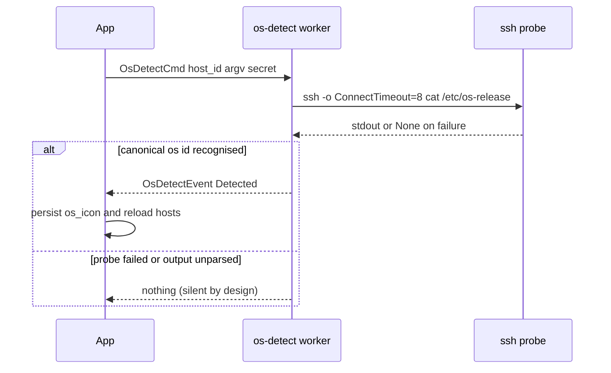

# Hosts, Groups & Identities

## Hosts

<!-- openwiki: broken internal link [../architecture/data-model.md#hybrid-host-model] heading anchor "hybrid-host-model" does not exist in "../architecture/data-model.md". Fix the href or restore the target, then delete this comment. -->
A host is the central entity. Storage and merging rules live in [data model](../architecture/data-model.md#hybrid-host-model); the user-facing model:

- **Managed hosts** (`HostSource::Launcher`) — full CRUD from the [host form](../workflows/tui.md) or [CLI](../workflows/cli.md); fields include address, port, username, tags, description, environment, per-host session-logging override, and `transport` (ssh/mosh).
<!-- openwiki: broken internal link [../architecture/overview.md#file-watcher] heading anchor "file-watcher" does not exist in "../architecture/overview.md". Fix the href or restore the target, then delete this comment. -->
- **ssh_config hosts** (`HostSource::SshConfig`) — imported/synced from `~/.ssh/config`; editable metadata but the connection fields track the config file (hot-reloaded by the [file watcher](../architecture/overview.md#file-watcher)); a row is re-synced only when `compute_ssh_config_hash` reports drift.
- **Legacy aliases** — ssh_config entries with no DB row; surfaced read-only with metadata from `metadata.db`.

`load_merged_hosts` (`src/hosts/loader.rs`) merges the three: sync ssh_config rows, load both DB sources, then append aliases that have no DB row. `upsert_ssh_config_host` never overwrites a `source=launcher` row (it returns `SkippedLauncher`), so imports and syncs can never clobber hosts the user created themselves; updates to ssh_config rows preserve user metadata (tags, notes, favorite).

Resolution always goes through `HostResolver` / `SshConfigResolver` (`src/ssh/resolver.rs`), which lists `Host` aliases (following `Include`, depth-capped at 16, with `*`/`?` glob support in the final path component) and resolves effective options with the real `ssh -G` (`hostname`, `user`, `port`, `proxyjump`, `identityfile`, `forwardagent`, `remotecommand`). The config path comes from `~/.ssh/config` unless `SSHUB_SSH_CONFIG` (fallback `SSH_LAUNCHER_SSH_CONFIG`) overrides it. Since 0.14.0, quoted aliases are unquoted the way OpenSSH unquotes them (`Host "web"` lists as `web`); before that, `ssh -G` rejected the quoted alias with `hostname contains invalid characters`, so the host showed up but could not be connected to. The hand-rolled `Host`-line parser is the one part of resolution sshub does itself (OpenSSH has no "enumerate hosts" mode), so it is pinned by a differential test that resolves every listed alias through the real `ssh` binary, per the oracle-test rule in `docs/oracle-tests.md`. `build_ssh_argv` / `build_mosh_argv` (`src/ssh/host.rs`) turn a resolved host into the spawn argv used by [embedded sessions](../workflows/sessions-sftp.md).

**Option-like values are refused at the store, not just at connect.** A host field starting with `-` is read by ssh as a flag, not a value (an address of `-oProxyCommand=id` runs `id` locally — issue #101). `create_host` / `update_host` therefore refuse a leading-dash `name`, `address` or `username` (`reject_option_like`; `is_option_like` is exposed so the host form can flag the value while the form is still open). Importers treat one refusal as one dropped row: the poisoned entry is skipped, the rest of the file lands, and the refusal is counted in the report (`skipped_invalid`). `safe_ssh_target` is the connect-time backstop: it rewrites a leading-dash target to the `ssh://` form OpenSSH refuses outright, so a row that predates the write guard fails loudly instead of executing anything.

### OS auto-detection (`src/osinfo/`)

On first connect, a background worker probes managed hosts whose `os_icon` is still empty. `connect_host_entry` sends an `OsDetectCmd` only when the host id is not already in the `os_detect_inflight` set, so a rapid re-connect never spawns duplicate probes. The worker thread (same mpsc shape as the ping worker, test seam via the `ProbeRunner` trait) shells a short non-interactive ssh: `cat /etc/os-release 2>/dev/null || uname -s` with `ConnectTimeout=8` and `BatchMode=yes` when there is no stored secret (askpass staging when there is). `parse_os` maps the output to a canonical id; only then is an `OsDetectEvent::Detected` emitted, drained on the UI tick and applied by `apply_os_detect` — persist the canonical id to `hosts.os_icon`, clear the inflight marker, reload hosts. Failures and unrecognised output are silent by design: no event, no notice, the `os_icon` stays empty. The host card renders a vendored ANSI/Braille logo through `OsLogoWidget`.

*The OS auto-detect worker: connect kicks off an inflight-guarded probe; only a recognised OS id produces an event that is persisted to `hosts.os_icon`.*

## Groups & Favorites

`host_groups` are **nested** (`parent_id`) and a host can belong to **multiple groups** via `host_group_memberships`. A `reserved` flag marks the built-in **Favorites** group — it is found by flag (`reserved = 1`), never by name, so a user's pre-existing "Favorites" group is never hijacked: if a user group already owns the name, the reserved group is created as "Favorites (2)" and the user's group stays untouched. Reserved groups cannot be renamed or deleted. `f` toggles favorite and a ★ marker shows in the list; the flag and the membership are kept in sync by `sync_favorite_membership` on every write path, and `ManagedHost::favorite` is derived at load from reserved-group membership. `set_host_groups` replaces only *non-reserved* memberships, so saving the host form never drops favorite status.

When a host belongs to more than one non-reserved group and has no identity of its own, `materialize_identity` copies the primary group's `default_identity_id` onto the host row, so an inherited identity stays stable across later membership changes. Favouriting a host (which joins the reserved group) never triggers materialization. Managed from the group manager (`Shift+G`) or `sshub group list|show|add|edit|delete`. Shipped in 0.7.0 per `docs/superpowers/specs/2026-07-10-multi-group-favorites.md`.

## Identities

An identity (`src/store/identities.rs`) bundles a display name, username, private key path, and an optional certificate path; a "Default" identity is seeded. Hosts reference identities via `identity_id`; groups carry a `default_identity_id` that materializes as described above. Secrets (key passphrases, host passwords) live in the OS keyring keyed `identity:{id}` / `host:{id}` — see [secrets](../security/secrets.md). Deleting an identity that hosts still reference is refused (`DeleteIdentityOutcome::InUse` with the host count).

- **ssh-agent** (`src/ssh/agent.rs`) — wrappers over `ssh-add -l` / `-d` (add runs plain `ssh-add path`); `detect_agent` reads `SSH_AUTH_SOCK` and parses the listing into type/bits/fingerprint/comment. The Keys tab shows loaded status and can add/remove keys (`p` / `r`; CLI: `sshub identity agent-remove`). Zoomed, the agent panel keeps the socket/forward-agent/config header and lists every loaded key, one selectable row per key (removable with `d`).
- **Key files** (`src/ssh/keyfile.rs`) — `ssh-keygen -y` probing detects whether a key needs a passphrase (`key_is_encrypted`) and whether a candidate passphrase decrypts it (`passphrase_matches`); both fail open (return `None`) when ssh-keygen is missing or the error is unrelated, so callers never block on an unknown. Every passphrase-carrying `ssh-keygen` invocation — probing, generation, public-key extraction — stages the secret through a `KeygenAskpass` helper: a `0600` secret file plus a `0700` script exported as `SSH_ASKPASS`, both removed on drop, so the passphrase never appears in `ps` argv.
- **Key generation** (`src/app/keygen.rs`) — `g` on the Keys tab opens a form for key type (Ed25519 or RSA-4096), passphrase, comment and target path. `generate_key_pair` refuses to overwrite an existing private key or its `.pub`. On success the identity is registered immediately (named after the comment, else the filename), the Keys tab reloads with it selected, and an optional passphrase is stored under `identity:{id}`.
- **Public-key push** (`src/app/push_key.rs`) — `Shift+P` from the hosts list opens an identity picker; from the Keys tab it opens a host picker. The public key is read from the `.pub` file when one exists, otherwise extracted with `ssh-keygen -y` and the identity passphrase staged via askpass. The remote command runs under `umask 077`, creates `~/.ssh/authorized_keys` if missing, and appends only when the exact line is not already present, so repeating the push is harmless. The push runs as a real session reusing the stored-credential path and both the attempt and its failures are audited.
- **Probing** (`src/ssh/probe.rs`) — defines `SshLogEntry`/`LogLevel`, populated by manual log pushes from the connect/session paths. The module's own background `ssh -v BatchMode` classifier (`spawn_ssh_probe`/`classify_line`), which used to periodically probe every known host, is dead code today (no callers) and was disabled because it "buried the events the user actually cares about" (`src/app/mod.rs`); the SSH log is reserved for user-initiated events and is capped at 200 entries. There is no live auth-method display in the detail panel; the server host-key fingerprint is shown on the connect screen, parsed from ssh's `-v` stderr.

## Importing hosts

`sshub import --from ssh|termius|putty|mremoteng [--dry-run]`. `--dry-run` parses and prints a preview without touching the store; it is supported for `termius`, `putty` and `mremoteng` and explicitly refused for `--from ssh`.

- **ssh** (`src/ssh/import.rs`) — resolves every listed alias and upserts `source=ssh_config` rows; launcher rows are skipped and counted.
- **Termius** (`src/import/termius_csv.rs`) — imports Termius backups (`L00t.csv` + `ssh_keys/` directory — format documented in `docs/termius-export-format.md`) as managed hosts and identities. Passwords/passphrases are re-stored into the keyring with **write-verification** (`store_credential_verified` sets the value and reads it back); failures surface as `keyring_failures` in the import report rather than silently dropping secrets. Key material is copied to `~/.ssh/termius_<name>`. TUI: `Shift+T`; covered by `tests/e2e/termius_import.rs`.
- **PuTTY** (`src/import/putty.rs`) — accepts a Windows `regedit /e` `.reg` export (UTF-16LE with BOM, `dword` ports) or a `~/.putty/sessions` directory (plain `Key=Value` files, decimal ports). Session names are percent-decoded (`My%20Server` → `My Server`). Only connections whose `Protocol` is `ssh` (or absent — historically the default) are imported; RDP/telnet/raw entries are counted in `skipped_non_ssh`, and the `Default Settings` pseudo-session (empty `HostName`) is dropped. Imported rows are launcher hosts with `notes = "Imported from PuTTY"`.
- **mRemoteNG** (`src/import/mremoteng.rs`) — parses `confCons.xml` with a hand-rolled XML reader (no XML crate, matching the house style). `Type="Container"` nodes form a folder breadcrumb that becomes the host's tags; `Type="Connection"` nodes with an `SSH*` protocol become hosts; every other protocol is counted as skipped. Encrypted `Password` attributes are **not decrypted** — these importers create hosts only and carry no stored secret. Rows are tagged `Imported from mRemoteNG`.

All three third-party importers share `HostImportReport` (`imported`, `skipped_existing`, `skipped_non_ssh`, `skipped_invalid`): hosts whose name already exists are skipped, never overwritten, and a row the store refuses (leading-dash field, issue #101) is dropped on its own without costing the rest of the file.

## Change guidance

- Host CRUD invariants (dedupe with ssh_config sources, favorite semantics, group nesting) are pinned by `tests/e2e/host_crud.rs`, `host_sort.rs`, `group_crud.rs`, `hybrid_compat.rs`, `ssh_config_sync.rs`.
- Import/sync must never overwrite `source=launcher` rows and never write the user's own `~/.ssh/config` (export goes to `exported.conf`).
- Keygen and push-key flows are pinned by `tests/e2e/keychain.rs` (including the group-header and identity-picker edge cases); Termius import by `tests/e2e/termius_import.rs`; PuTTY and mRemoteNG imports by `tests/smoke/cli_commands.rs`.
- The resolver's alias listing is pinned by a differential test against the real `ssh` binary (`listed_aliases_round_trip_through_real_ssh`), which degrades — not fails — when `ssh` is absent.
