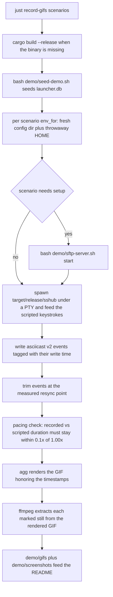

# Integrations

SSHub deliberately has a small runtime integration surface: the embedded PTY is the
only session transport, secrets go through the OS keyring, and the `ssh` binary does
the connecting. Everything else on this page — the npm shim, the demo recorder — is
packaging and contributor/release tooling, plus the external tools the app shells out
to.

## External-terminal launcher status (removed)

The retired Kitty/Ghostty/custom-command `TerminalLauncher` subsystem was removed in
0.10.0 and is **fully deleted**: no trait, no `src/launcher/` directory, and no test
doubles remain in the tree. The only residue is the two ignored legacy config keys —
`terminal` and `launch_command` — which older `config.toml` files may still carry.
Those files keep loading because the config model does not deny unknown fields; the
regression test `parse_config_applies_overrides` (`src/config.rs`) pins exactly that:
a config carrying the removed keys parses fine and the rest of the settings still
apply (issue #30).

There is no external launch path to extend or re-enable. [Embedded PTY
sessions](../workflows/sessions-sftp.md) are the connection transport (per-host `ssh`
or `mosh`; tunnels and SFTP are ssh-only). Do not add runtime behavior under the
removed `src/launcher/` path — `wrap_script_command` in `src/session_log.rs`, which
wraps external command spawns in `script(1)` for session logging, is the closest
surviving concept and belongs where it is.

## npm distribution (`npm/`)

### The shim (`npm/wrapper/bin/sshub.js`)

The npm wrapper package is `sshub-tui`, not `sshub` — npm refuses the bare name as
too close to the existing `ssh2` and `sshpk` — but the command it installs is still
`sshub` (bin name is independent of package name). The real binary lives in one of
three platform-specific optional dependencies that npm installs only where its
`os`/`cpu` match:

| Platform key | Package |
|---|---|
| `linux-x64` | `sshub-linux-x64` |
| `darwin-arm64` | `sshub-darwin-arm64` |
| `darwin-x64` | `sshub-darwin-x64` |

The shim never downloads anything; on each run it:

1. Looks up `${process.platform}-${process.arch}` in the fixed package map. An
   unsupported platform dies with a *build from source: `cargo install sshub`*
   hint; a missing optional dependency (`--no-optional` installs, interrupted
   installs) dies with a reinstall hint.
2. Resolves the platform package's `bin/sshub` with `require.resolve`.
3. **Repairs the executable bit**: npm normally preserves it, but a zip-based store
   or an over-eager umask can drop it; the shim checks `X_OK` and, failing that,
   `chmodSync(bin, 0o755)` — cheaper to fix than to explain. If the repair is
   refused, it dies.
4. Spawns the binary with `spawnSync` and `stdio: 'inherit'` so the child gets the
   real TTY (the TUI needs it) and shares the process group, so Ctrl+C reaches the
   binary from the terminal rather than through the shim. If the child dies by
   signal, the shim re-raises the same signal on itself so the shell sees the real
   cause; otherwise it exits with the child's status (1 when absent).

Before spawning it exports `SSHUB_INSTALL_CHANNEL=npm`. This marker exists because
the shipped binary is **byte-identical to the release-tarball binary** — `npm
build.sh` repacks the very tarballs the release workflow attached (below) — so no
path heuristic can tell an npm install from a GitHub-release install. The env var is
the only honest signal.

### Install-channel detection (`src/tui/widgets/tab_bar.rs`)

The tab bar shows the resolved version at the far right, with the detected install
channel as a suffix so a support conversation can tell how the binary got onto the
machine. Resolution order, most specific first:

- `SSHUB_INSTALL_CHANNEL` set and non-empty → that value verbatim (the npm shim sets
  `npm`).
- The binary lives in cargo's install bin dir (`$CARGO_HOME/bin`, else
  `~/.cargo/bin`) → `cargo`.
- The binary sits inside a build-target dir (`target/`, or a custom `…-target/` via
  `CARGO_TARGET_DIR`) → `source` (a `cargo run`/`cargo build` out of the checkout);
  the same applies under `~/.local/bin` (the `just install` destination).
- Anything else (distro package, manual copy) → no channel, no suffix.

The version label itself follows `SSHUB_VERSION_LABEL`: unset → `v{CARGO_PKG_VERSION}`
plus the ` · {channel}` suffix when a channel was detected; set but empty → the label
is hidden entirely; set and non-empty → that exact string verbatim, no suffix. Demo
recordings set it empty so the GIFs never advertise a stale version (see below).

### Assembling and publishing (`npm/build.sh`)

`npm/build.sh` compiles nothing. It downloads the `sshub-*.tar.gz` release assets for
the version (from `gh release download v$version`, or `TARBALL_DIR` when CI supplies
workflow artifacts), extracts each into a platform package (`bin/sshub` chmod 755,
plus `package.json`/README/LICENSE rendered from `npm/platform/*.in`), copies the
wrapper's `bin/sshub.js` into the `sshub-tui` package, and renders the wrapper
manifest from `npm/wrapper/package.json.in` (bin `sshub` → `bin/sshub.js`, engines
node ≥ 18, `optionalDependencies` pinned to the three platform packages). Verification
on a Linux x86_64 host runs the extracted binary's `--version` — which must equal
`sshub $version`, catching packaging that points at a different release than it
claims — then mirrors a real install (`node_modules/sshub-linux-x64` symlink) and
drives the shim exactly the way `npx sshub` would, requiring the same version
output. All four packages get an `npm pack --dry-run`.

Publishing order matters: the three platform packages go first and `sshub-tui` last,
because the wrapper's `optionalDependencies` must already exist in the registry —
published the other way round, the wrapper resolves to no binary at all and fails for
everyone installing in that window. Re-runs skip versions already in the registry
(registry versions are immutable, so a re-run after a partial failure skips what
landed instead of dying on *cannot publish over the previously published version*).
The [release workflow](../operations/ci-cd.md) publishes via **OIDC trusted
publishing** (`id-token: write`, npm ≥ 11.5.1) rather than a long-lived `NPM_TOKEN`,
with npm attaching provenance itself; each of the four packages needs a trusted
publisher configured on npmjs.com pointing at `release.yml`. crates.io publishing
(`cargo publish` with the `CARGO_REGISTRY_TOKEN` secret) runs as a separate job of
the same workflow.

## Demo pipeline (`demo/`) — contributor/release tooling

The `demo/` tree is contributor/release infrastructure for the README media, not
product runtime: it is excluded from the published crate (`Cargo.toml` `exclude`)
together with the generated media, and the README embeds `demo/gifs/*.gif` and
`demo/screenshots/*.png` from GitHub URLs.

*The demo recording pipeline: seed once, record the PTY byte stream per scenario, trim at the measured resync point, check pacing, then render GIF and stills.*

### Why the terminal byte stream, not screenshots

`demo/record.py` replaced the VHS tapes. VHS renders the session in a headless
browser and *screenshots* it on a timer; SSHub redraws at ~60fps while animating, the
capture rate collapsed under that, and because the video was written at a constant
frame rate the missed frames came out as a sped-up recording — measured at 0.28x real
time on `navigate`, with transitions down to three frames. Recording what the program
actually wrote, tagged with the moment it was written (asciicast v2), makes the
timeline exact by construction: nothing is sampled, idle stretches collapse into one
long frame, and `agg` renders honoring the timestamps so every take plays at 1.00x
with animations included (and about a third of the old size).

Recording requires `agg` (`cargo install --git https://github.com/asciinema/agg`) and
ffmpeg. Run everything (`demo/record.py`) or a subset (`demo/record.py hero navigate`,
or `just record-gifs hero sftp`).

### Mechanics

- **`Tape`** is a keystroke timeline (`key`, `type`, `sleep`) that reads like the
  `.tape` files it replaced minus the shell: the binary is started directly with its
  environment already set, so there is nothing to type into a prompt and nothing to
  `Wait` for. Typing paces at 40ms/char, matching the tapes' `Set TypingSpeed 40ms`.
- **`begin()` trims by resync, not by dropping events.** Trimming a byte-stream
  recording is not simply dropping earlier events: ratatui writes cell diffs, so the
  survivors would paint onto a screen that was never drawn (missing logo, half-there
  header counters). The scheduled `resync` action narrows the PTY by one column —
  `src/lib.rs` resizes all sessions on any size change, forcing a full repaint —
  waits for it, restores the width, and the trim point is *measured* at that moment,
  so the recording starts on a complete screen.
- **`still(name)`** markers keep a moment as a screenshot. They are scheduled like a
  keystroke but measured at record time (script-time drift would catch popups
  mid-animation), and each reserves a beat afterwards so the marker does not share a
  timestamp with the next keystroke. Stills are extracted from the rendered GIF with
  ffmpeg — the last frame at or before the mark (an idle screen emits no frames at
  all, since ratatui only writes what changed, so "the next frame" is whatever moved
  next, usually a popup opening). They inherit the GIF's 256-colour palette, which is
  lossless in practice for a terminal palette a few dozen colours wide.
- **Pacing check:** the expected visible duration is the last scripted timestamp
  minus the trim start, plus the 1.5s tail. A take is `ok` only when
  recorded/expected stays within ±0.1 of 1.00x; any `OFF` take fails the run. This is
  what guards the 1.00x animation timeline.
- **Rendering:** `agg` runs with `--fps-cap 50`, the Catppuccin Mocha 16-slot theme
  (the palette the old tapes asked xterm.js for), `JetBrainsMono Nerd Font Mono` (the
  Mono variant, or agg warns about cell metrics), and a 2s last-frame duration, at
  150×40 cells.

### Fixture home and environment

Each scenario runs under `env_for`: a pristine config directory
(`/tmp/sshub-demo-<slug>`, copied from `demo/home/.config/sshub/config.toml` so one
run cannot leak settings into another) and a throwaway `$HOME`
(`/tmp/sshub-demo-home`, holding a pristine `sftp-local` folder and a fresh `.ssh`)
— a real `$HOME` would publish the recorder's username and directory layout in the
README, and the SFTP browser prints the local pane's cwd on screen.
`SSHUB_VERSION_LABEL` is set empty so the version label is hidden and GIFs never
advertise a stale version, and `demo/bin` plus `target/release` are prepended to
`PATH`. Motion is deliberately left **on**: `disable_animation` is the reduced-motion
toggle and would switch off every slide these recordings exist to show (the old tapes
used it to skip the intro animation, which is why four of the five GIFs had no motion
at all); the intro is dismissed with a keypress instead.

- `demo/seed-demo.sh` resets and seeds `demo/home/.local/share/sshub/launcher.db` by
  running the `seed-demo` Cargo example (`demo/seed_demo.rs`, an example rather than
  a bin so `cargo install sshub` never installs it). It wipes `launcher.db` /
  `metadata.db` (plus `-wal`/`-shm`) for a deterministic re-seed, then creates the
  nested groups (Production → Web, Databases; Staging) and seven hosts whose
  addresses are real, pingable public anycast resolvers (Google, Cloudflare, Quad9,
  OpenDNS, Level3) so cards show *online* — the actual connect is simulated. When
  the SFTP server's client key exists, the seeder also adds a real
  `127.0.0.1:2222` host with that key as its identity.
- `demo/sftp-server.sh start|stop|status` supports the transfer scenarios: SSHub's
  SFTP browser speaks native libssh2, so it needs an actual server. The script spins
  up a rootless sshd bound to `127.0.0.1:2222` (port overridable via
  `SSHUB_SFTP_DEMO_PORT`) with an ephemeral ed25519 host key and client key under
  `demo/home/.ssh`, pubkey-only auth, and `ForceCommand internal-sftp -d <sandbox>`
  so every login lands in a curated fake deploy tree instead of the recorder's real
  `$HOME`; a curated local folder is regenerated too. Because the host key is
  ephemeral, `start` purges the stale `[127.0.0.1]:port` line from the recorder's
  `known_hosts` (`ssh-keygen -R`) so trust-on-first-use re-records the current
  ephemeral key instead of tripping the host-key-changed (MITM) guard.
- `demo/bin/ssh` shadows the real `ssh` (demo/bin is prepended to `PATH`) and renders
  a believable remote session: it emits an `ssh -v`-style handshake on stderr —
  including the *Authenticated to* marker that `src/session`'s `CONNECTED_NEEDLES`
  latch as the only honest connected signal — then runs interactive bash with an
  rcfile that fakes the target box (fake `uname`, `hostname`, `ls`, `df`, `uptime`,
  prompt as `deploy@<host>`), and redirects bash's stderr onto the PTY so the prompt
  is visible. `demo/bin/cowsay` is a tiny cowsay stand-in. Do not install these on a
  real `PATH`.
- Scenarios: `hero`, `navigate`, `connect`, `add-host`, `sftp` (which drives the
  sftp-server helper via setup/teardown and runs with cwd `sftp-local`), and
  `screenshots` (stills only — its GIF is scratch). Generated GIFs land in
  `demo/gifs/` and stills in `demo/screenshots/`; per-take asciicasts land in
  `demo/build/`.

## External tools SSHub drives

- **OS keyring / Secret Service** (`src/credentials.rs`) — the `PasswordStore` trait
  seam with `OsKeyring` over the `keyring` crate (service `"sshub"`); a
  `check_keyring_available` probe distinguishes a missing Secret Service provider
  (`org.freedesktop.secrets` / `ServiceUnknown`) from other failures, and where no
  keyring exists an owner-only `FilePasswordStore` (`credentials.json`, 0600 temp
  file + atomic rename) takes over and migrates back once a keyring returns.
  Details: [secrets](../security/secrets.md).
- **ssh-agent** (`src/ssh/agent.rs`) — `SSH_AUTH_SOCK` detection and `ssh-add
  -l/-d` wrappers parsed into type/bits/fingerprint/comment; the Keys tab and the
  CLI add/remove keys. See [hosts & identities](../domain/hosts-identities.md).
- **`ssh` / `mosh`** (`src/ssh/host.rs`) — `build_ssh_argv` / `build_mosh_argv` turn
  resolved hosts into argv (port, identity, certificate, ProxyJump, ForwardAgent),
  with `safe_ssh_target` rewriting leading-dash targets to an `ssh://` form OpenSSH
  refuses, and `StrictHostKeyChecking=accept-new` injected when a secret is staged
  or a mosh session runs.
- **`ssh -G`** (`src/ssh/resolver.rs`) — effective host options (`hostname`, `user`,
  `port`, `proxyjump`, `identityfile`, `forwardagent`, `remotecommand`) are resolved
  by shelling the real `ssh -G` against `SSHUB_SSH_CONFIG` /
  `SSH_LAUNCHER_SSH_CONFIG` / `~/.ssh/config`; alias listing follows `Include`
  directives depth-capped at 16. See [hosts & identities](../domain/hosts-identities.md).
- **`ssh-keygen`** — per-line fingerprinting for the known-hosts manager
  (`ssh-keygen -l -f -` in `src/known_hosts.rs`), guarded deletion (`ssh-keygen -R`),
  and key/passphrase probing (`ssh-keygen -y` in `src/ssh/keyfile.rs`) where the
  passphrase is staged through a 0600/0700 `KeygenAskpass` helper rather than argv.
  See the [known-hosts manager](../workflows/known-hosts.md) and
  [secrets](../security/secrets.md).
- **`known_hosts`** — the SFTP transport verifies host keys trust-on-first-use
  against `~/.ssh/known_hosts`, appends unknown entries *manually* (libssh2's file
  writer would drop unparsable lines such as `@cert-authority`) and treats a changed
  key as a hard MITM error (`src/sftp/transport.rs`).
- **Third-party host exports** (`src/import/`) — Termius backups (`L00t.csv` +
  `ssh_keys/`, secrets re-stored with write-verification), PuTTY saved sessions (a
  Windows `regedit /e` `.reg` export or a Unix `~/.putty/sessions` directory; SSH
  only), and mRemoteNG `confCons.xml` (SSH-protocol connections; encrypted passwords
  not decrypted). All three share `HostImportReport`. See
  [hosts & identities](../domain/hosts-identities.md).
- **GitHub Actions / crates.io / npm registry** — the tag-triggered release workflow
  builds the three platform tarballs, creates the GitHub release, repacks those same
  tarballs into the npm packages (OIDC trusted publishing), and publishes the crate
  with `CARGO_REGISTRY_TOKEN`. See [CI & automation](../operations/ci-cd.md) and
  [build & release](../operations/build-release.md).

## Change guidance

- Legacy-key tolerance is pinned by `parse_config_applies_overrides`
  (`src/config.rs` tests); anything new that removes a config key should extend that
  test rather than adding runtime behavior.
- Install-channel and version-label rules are pinned by the `tab_bar.rs` unit tests
  (`install_channel_resolution`, `version_label_gains_channel_suffix`,
  `version_label_resolution`); the npm shim has no automated test — `npm/build.sh`'s
  Linux verification step is its only end-to-end check.
- Demo recordings are their own regression test: the pacing verdict (`ok` vs `OFF`)
  fails the run when a take drifts from the scripted timeline; keep scenario scripts
  and expected durations in sync when changing animation timing.
- The fake `demo/bin/ssh` must keep matching the markers SSHub looks for (the
  `Authenticated to` connected needle and the stderr-siphon side channel) whenever
  the session lifecycle changes.
