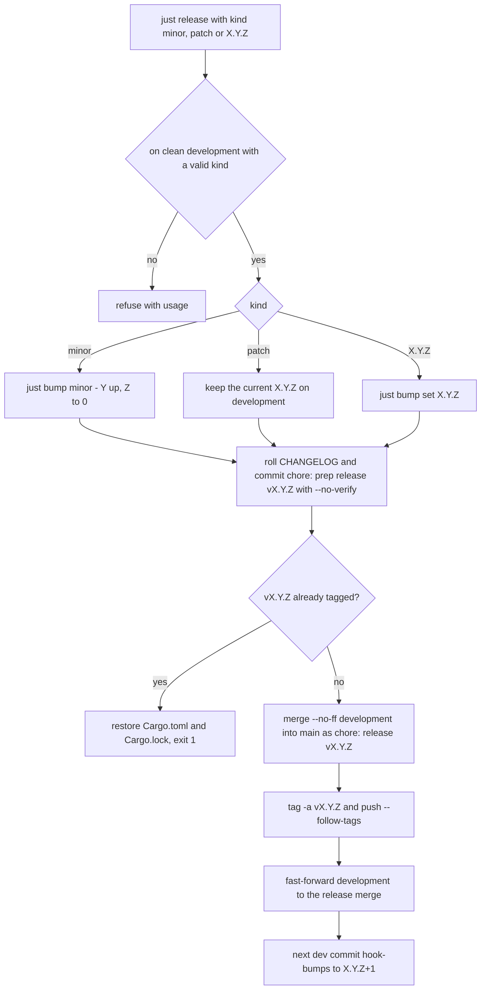

# Build, Versioning & Release

## Everyday commands

```bash
just build      # cargo build --release (default features — the shipping configuration)
just test       # unit + smoke + e2e + config_load (all four targets, --no-default-features)
just dry-run    # cargo run -- --dry-run
just coverage   # cargo-llvm-cov + the never-executed function list (docs/coverage-map.md)
```

Lint gate (run before **every** push; [CI](ci-cd.md) runs the same): `cargo fmt`, `cargo fmt --check`, `cargo clippy --all-targets`.

## Justfile recipes

| Recipe | What it does |
|---|---|
| `test` | All 4 test targets with `--no-default-features` (see [testing](../testing/strategy.md)) |
| `build` | Release binary (prerequisite of `install`; default features — what ships) |
| `coverage` | cargo-llvm-cov + `scripts/uncovered-functions.py` → the never-executed list for `docs/coverage-map.md` |
| `install` / `uninstall` | Binary → `~/.local/bin`, completions, man page, icon + `.desktop` entry (kitty→ghostty→alacritty→foot→xterm detection) |
| `install-completions` | bash/fish completions to auto-load dirs; sourced zsh block appended to `~/.zshrc` |
| `man` | Preview `man/sshub.1` via `man -l` |
| `bump <patch\|minor\|major\|set> [version]` | Odometer version bump in `Cargo.toml` + `Cargo.lock` (no cargo invocation) |
| `release <minor\|patch\|X.Y.Z>` | Full release: settle version on `development`, roll CHANGELOG, `--no-ff` merge to `main`, tag `vX.Y.Z`, push, ff `development` |
| `sync` | Merge `development`→`main` without a release (no tag/bump/changelog) |
| `npm-build [version]` | Assemble the npm packages + wrapper into `npm/dist` from the GitHub release tarballs (no compilation; shim exercised first) |
| `npm-publish [version]` | `npm-build` then publish: platform packages first, the `sshub-tui` wrapper last |
| `setup-hooks` | One-time `git config core.hooksPath .githooks` per checkout |
| `setup-shared-target` | Point this checkout's build output at the shared `../.cargo-target` (writes untracked `.cargo/config.toml`) |
| `worktree-add <name> [branch]` | Isolated worktree under `../.worktrees/<name>` on `feature/<name>` (default), sharing the cargo target |
| `worktree-rm <name> [delete-branch]` | Remove the worktree; sweeps its stale artifacts |
| `sweep [size=4GB]` | Prune the shared target dir with cargo-sweep (by size; use `cargo sweep --time N` for by-age) |
| `record-gifs *scenarios` | PTY-capture demo recording via `demo/record.py` (needs `agg` + ffmpeg; see [integrations](../integrations/external-terminals.md)) |
| `dry-run` | Headless sanity check |

## Vendored OpenSSL — the default feature that makes shipped builds self-contained

The `vendored` feature (`ssh2/vendored-openssl`, compiling OpenSSL from source) is **on by default** because `cargo install sshub` and the release tarballs must build with **no system OpenSSL present**. It is a feature only so local development can opt **out** with `--no-default-features`, linking the system libs instead — about 120 MB less `target/` per profile and most of a cold build's wall clock. `just test` already passes the flag.

Never pass `--no-default-features` on anything that ships: `just build`, CI (`cargo build --all-targets` / `cargo test`), and the release workflow all stay on the default, which is what makes the tarball, `cargo install sshub`, and crates.io builds self-contained.

## Release profile: fast binary, no backtraces

`[profile.release]` sets `lto = "thin"`, `codegen-units = 1`, and `strip = "symbols"`:

- **Slow release builds, optimized binary.** Thin LTO plus a single codegen unit optimize across crate boundaries — this is the binary the tarballs, `cargo install sshub`, and npm all ship.
- **Empty `RUST_BACKTRACE` in shipped builds.** Release never carried debug info (release defaults to `debug = false`), and `strip = "symbols"` removes the symbol table — so a panic backtrace in anything shipped is empty. Reproducing a panic with a readable backtrace requires a **debug** build. The dev profile compensates for disk: full DWARF for every dependency was ~40% of `target/`, so dev uses `debug = "line-tables-only"` — line tables keep backtraces readable for SSHub's own code.
- **`panic` stays on `unwind`, on purpose.** Not for the tty (the panic hook restores it under `abort` too): with unwind, a worker thread's panic (watcher, ping, broadcast, sftp, os-detect) kills only that thread and leaves the TUI alive, and every cleanup `Drop` still runs — including `AskpassSecret`, which removes the file holding a host's password.

## Multi-agent worktrees & the shared Cargo target

Several agents work in parallel on one machine: the main checkout stays in `ssh-tui/`, extra agents get git worktrees, and **all** of them share one Cargo artifact dir to save disk (~1.2 GB per full dev+test+release cycle — not one such dir per agent):

```text
sshub-dev/
  .cargo-target/          ← real cargo artifacts (build.target-dir)
  .worktrees/<agent>/     ← isolated checkouts
  ssh-tui/                ← main checkout
    .cargo/config.toml    ← untracked (gitignored), points at ../.cargo-target
```

- **`just setup-shared-target`** — run once per checkout/worktree. Writes an untracked `.cargo/config.toml` with an **absolute** `build.target-dir` (absolute because worktrees sit one level deeper than the main checkout, so no single relative path fits both). There is deliberately **no `target` symlink**: `cargo clean` deletes a symlink, after which cargo silently starts building into a private `./target` and the shared dir quietly becomes one copy per agent. If you find a `target` symlink, don't repair it by hand — `setup-shared-target` migrates it (and an existing real `./target`) into the shared dir.
- **`just worktree-add <name> [branch]`** — creates `../.worktrees/<name>` on branch `feature/<name>` (default) and points its build at the shared target. Both worktree recipes resolve the main checkout via `git rev-parse --git-common-dir`; `git rev-parse --show-toplevel` is wrong here — run from a worktree it yields `.worktrees/<name>` and you get nested `.worktrees/.worktrees/`.
- **`just worktree-rm <name> [delete-branch]`** — force-removes the worktree; the branch survives unless you pass `delete-branch`. That branch's artifacts become unreachable but stay in the shared dir, so the recipe sweeps when cargo-sweep is installed.
- **`just sweep [size=4GB]`** — cargo **never** deletes artifacts of branches you moved off, so the shared dir only grows; `sweep` prunes it with `cargo sweep --maxsize`, capped at 4 GB by default. It must be invoked on the **project path** — cargo-sweep resolves the target dir itself, and pointed at the target dir it looks for a `Cargo.toml` inside it.
- **Never run two cargo builds (or two `just test`) at once against the shared target** — fingerprint races. Serialize: one agent compiling at a time.

## Versioning — odometer `vX.Y.Z`

Each field rolls 0–9 and carries (`0.9.9 + patch → 1.0.0`):

- **Z (patch)** — bumped on **every commit to `development`** by the tracked pre-commit hook (`.githooks/pre-commit`, runs `just bump patch`; skipped on other branches and merges). Enable once per checkout with `just setup-hooks`.
- **Y (minor)** — bumped when merging `development → main` for a feature release; resets Z (`X.Y.0`).
- **X (major)** — manual milestone bump, or automatic carry on rollover.

`main` is not always `X.Y.0`: hotfix releases publish `development`'s current `X.Y.Z` unchanged.

`just bump <patch|minor|major|set> [version]` edits `Cargo.toml` and the `sshub` entry in `Cargo.lock` with `sed` — no cargo invocation, keeping the pre-commit hook fast and offline. Carries: `0.4.9 + patch → 0.5.0`, `0.9.9 + patch → 0.10.0`, `0.99.0 + minor → 1.0.0`, `0.99.9 + patch → 1.0.0`.

### The pre-commit auto-bump hook

The hook is tracked in the repo but **not active on clone** (git doesn't share hooks) — `just setup-hooks` sets `core.hooksPath .githooks` once per checkout. On every commit it:

1. checks the branch-name shape via `scripts/check-branch-name.sh` (the "some commit is a `fix:`" substantive check runs in CI, which sees the whole branch);
2. exits unless the branch is `development` — other branches never tick the counter;
3. exits while a merge/rebase/cherry-pick is in progress (`MERGE_HEAD`/`REBASE_HEAD`/`CHERRY_PICK_HEAD`), and no-ops if `just` isn't installed, so it can never block a contributor without the toolchain;
4. runs `just bump patch` and re-stages `Cargo.toml` + `Cargo.lock`.

Contributors therefore never bump the version by hand (CONTRIBUTING.md says so explicitly).

## Release flow (`just release`)

Run from a clean `development`. The recipe **requires an explicit kind** — `minor`, `patch`, or `X.Y.Z`. There is no default on purpose: a bare `just release` used to mean `minor`, silently bumping when you meant to ship what `Cargo.toml` already says.



*The `just release` flow: settle the version on `development`, roll the changelog, merge to `main`, tag (the tag triggers [the release workflow](ci-cd.md)), then converge the branches.*

1. **Settle on `development`** — set the release version in `Cargo.toml` + lock, roll the CHANGELOG (`[Unreleased]` → `[X.Y.Z] - <date>`, fresh empty `[Unreleased]` on top), commit as `chore: prep release vX.Y.Z` with `--no-verify` (so the hook doesn't re-bump). Settling **on development** (not on main) is what keeps the dev odometer running from the released `X.Y.Z` instead of going stale — a stale dev version made the next `just release minor` collide with an existing tag. The recipe refuses an already-tagged `vX.Y.Z` (restores the files, exits 1), skips the changelog roll if the section already exists (a recovery re-run), and skips the prep commit if there is no diff.
2. **Merge & tag** — `git merge --no-ff development` into `main` (`chore: release vX.Y.Z`), tag `vX.Y.Z`, push. That one tag push is the single trigger for every distribution channel: the release workflow builds the three target tarballs, creates the GitHub release with `CHANGELOG.md` as the body, publishes to crates.io, and assembles + publishes npm from the same artifacts — nothing is published until it lands.
3. **Converge** — fast-forward `development` to the release merge so both branches point at the same commit; the next dev commit hook-bumps to `X.Y.Z+1`.

Consequences: `git log --first-parent main` shows one commit per release; reverting a whole release is `git revert -m 1 <merge>`; reverting one feature is reverting its squashed dev commit (after reverting a merge, re-landing the same history needs a revert of the revert). Merges stay clean because `development` is ff'd to `main` after every release, so `main` is always an ancestor of `development`; if `main` ever gets a direct commit anyway, merge `main` into `development` first. `just release patch` ships whatever `development` currently holds — land only the fix first if `development` carries unreleased work. Pushing to protected `main` relies on the owner's admin bypass.

**`just sync`** brings `main` up to date with `development` between releases — a `--no-ff` `chore: sync development into main` merge with **no** version bump, changelog roll, or tag, so the release workflow is **not** triggered (docs/CI fixes ride the next release anyway; sync is for when they can't wait). `development` is fast-forwarded back, keeping the next release merge clean.

### Hotfix flow (pointer)

`just release` runs only on `development` and ships everything sitting there. To ship fixes while **holding back** work already on `development`, use the hotfix flow in [CLAUDE.md § Hotfix release](../../CLAUDE.md): branch `fix/release-X.Y.Z` from `origin/main`, cherry-pick the squashed per-PR commits, **scrub the excluded feature out of what ships** (its CHANGELOG entries stay behind, and any other entry that merely mentions it must lose that mention — grep `src/`, `man/`, `README.md`, completions, help text), set the version and roll the changelog by hand (`just bump set X.Y.Z`), verify the **release tree**, open a PR into `main` for CI only (don't merge with the button — `main`'s first-parent line must read one `chore: release vX.Y.Z` per release), merge and tag locally, then **merge `main` back into `development` right away** — skipping that last merge lets the next `development → main` merge quietly revert the fix.

## npm distribution (`just npm-build` / `just npm-publish`)

npm users get the **same prebuilt binaries the GitHub release ships** — `npm/build.sh` compiles nothing.

- **`just npm-build [version]`** downloads the `sshub-*.tar.gz` artifacts attached to the `vX.Y.Z` GitHub release (`gh release download`; `TARBALL_DIR=dir` uses local copies instead, which is what CI passes), extracts each binary into a per-platform package — `sshub-linux-x64`, `sshub-darwin-arm64`, `sshub-darwin-x64` — with `package.json`/README rendered from `npm/platform/*.in` (including each package's `os`/`cpu` matchers), and assembles the `sshub-tui` **wrapper** around `npm/wrapper/bin/sshub.js`, whose `package.json.in` lists the three platform packages as pinned `optionalDependencies` (npm installs the one matching the machine and skips the rest). Before declaring success it verifies: on a Linux x64 host the extracted binary must report the packaged version, and the shim — driven exactly the way `npx` would, via a `node_modules` symlink mirroring a real install — must reach it and report the same. Every package is also `npm pack --dry-run`-ed.
- **`just npm-publish [version]`** is the same script with `--publish` (local runs need `npm login` or a token in `~/.npmrc`): it publishes the **three platform packages first and the wrapper last**, because the wrapper's `optionalDependencies` must exist by the time it lands — published the other way round, npm resolves the wrapper to no binary and installs fail for everyone in that window. Versions already in the registry are skipped rather than fatal, so re-running after a partial failure is idempotent.
- **The wrapper is `sshub-tui`, not `sshub`**: npm rejects the bare name as too close to the existing `ssh2` and `sshpk` packages. The command it installs is still `sshub` (the bin name is independent of the package name).
- The shim never downloads anything: it maps `process.platform-arch` to the one platform package that installed, `require.resolve`s its `bin/sshub`, repairs a missing executable bit, and spawns the binary with `stdio: 'inherit'` (the real tty the TUI needs, same process group so Ctrl+C reaches the child) and `SSHUB_INSTALL_CHANNEL=npm` — the env marker the version badge reads to report the npm install channel, because the prebuilt binary is byte-identical to the release-tarball one and path heuristics cannot tell them apart. The shim propagates the child's signal and exit status.
- In [CI](ci-cd.md), the release workflow's npm job runs `npm/build.sh "<tag version>" --publish` with the workflow artifacts as `TARBALL_DIR` — the version comes from the **tag**, so a tag/version mismatch fails in CI instead of reaching the registry — and authenticates by trusted publishing (OIDC), not a long-lived token.

## Coverage — where the tests never go

`just coverage` runs `cargo-llvm-cov` twice (JSON export + summary) and pipes the JSON into `scripts/uncovered-functions.py`, which prints the `src/` functions **no test executes even once**, largest first — the tables in `docs/coverage-map.md`. It needs cargo-llvm-cov plus `llvm-tools-preview` on a rustup toolchain; on a distro toolchain (no rustup) the recipe points cargo-llvm-cov at the system `llvm-cov`/`llvm-profdata` itself.

The percentage is the boring number; the never-executed list is the useful one — a function no test enters has never been observed working, no matter how many passing tests exist. That is why there is deliberately **no coverage floor in CI**: a percentage gate is satisfied by tests that execute code without asserting anything. The script handles the traps that produced confidently wrong numbers before: the report lists each function once per test binary (counts must be summed per mangled name), a zero count alone is not proof (degenerate entries on executed lines exist — line segments are the arbiter), and single-line spans are unused instantiations, not functions.

## Branch model & contributor flow

`feature/*` branches cut from `development` → PR → `development` → release merges to `main`. `main` is releases only — never a PR target. Merged branches are deleted (GitHub auto-delete enabled; delete locally after a CLI merge). Branch names are `<prefix>/<slug>` keyed to what the work *is* (`feature/` = `feat`, `fix/` = `fix`, `docs/` = `docs`, `chore/` = chore/ci/build/refactor/perf/style/test, `poc/` = anything), enforced by `scripts/check-branch-name.sh` in the pre-commit hook (shape only) and in CI (commit types of every commit on the branch; forks are skipped). The pinned pipeline (issue → claim → branch → verify → adversarial review → PR) is [docs/implementation-flow.md](../../docs/implementation-flow.md); agent-authored GitHub comments must end with `_Written by {Model} ({Platform}) on behalf of the maintainer._` See `CONTRIBUTING.md` and `CLAUDE.md` (canonical rules; do not duplicate them here).
