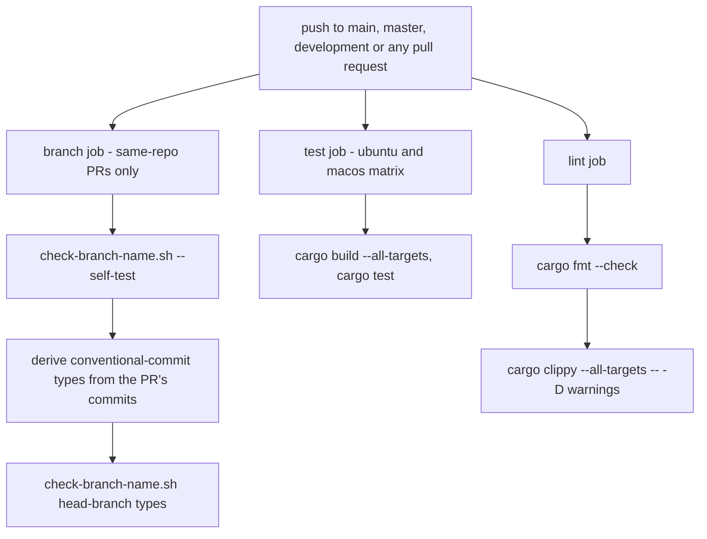
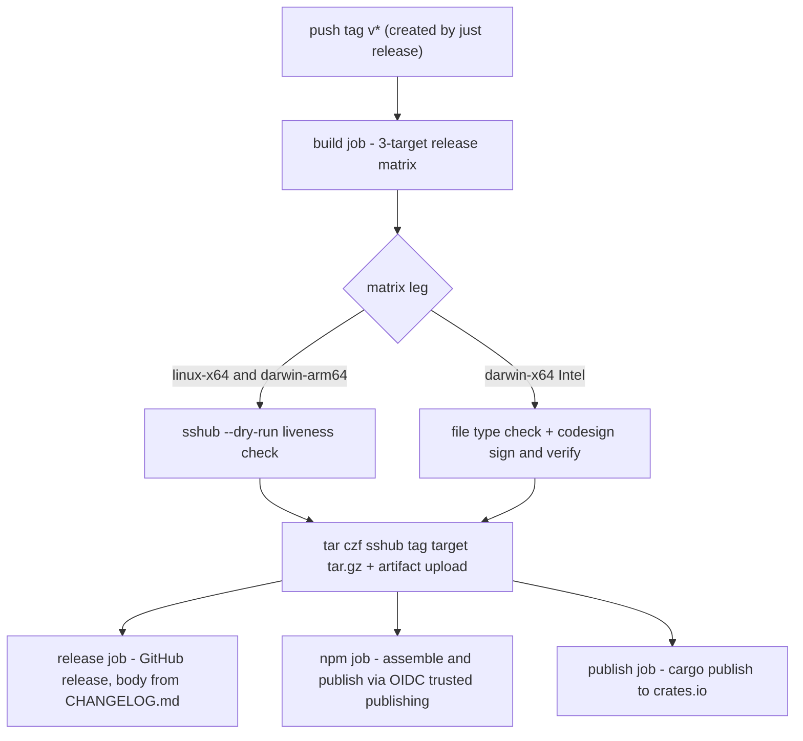

# CI & Automation

Four workflows under `.github/workflows/` carry all repository automation:

| Workflow | Trigger | What it does |
|---|---|---|
| `.github/workflows/ci.yml` | push to `main`/`master`/`development`, every PR | branch-naming gate, test matrix, strict lint |
| `.github/workflows/release.yml` | tag push `v*` | builds the three release binaries, GitHub release, crates.io + npm publish |
| `.github/workflows/openwiki-update.yml` | `workflow_dispatch` + daily cron | regenerates the OpenWiki wiki, opens a PR |
| `.github/workflows/strix-pentest.yml` | `workflow_dispatch` only | Strix security scan of the tree |

## `ci.yml` — the PR gate



*The `ci.yml` jobs: branch naming is enforced only for same-repo PRs, tests run on two OSes, lint fails on any warning.*

### `branch` — branch-naming enforcement

Runs only when the PR head repo equals the base repository — **forks are skipped**, because a contributor's branch name is not ours to police. It needs `fetch-depth: 0` so the whole branch history is available. Two steps:

1. `scripts/check-branch-name.sh --self-test` — "check the checker" by running the script's own case table.
2. Check the actual branch, deriving the conventional-commit type of **every commit the PR adds**:

```bash
types=$(git log --format=%s "$BASE_SHA..$HEAD_SHA" \
  | sed -nE 's/^([a-z]+)(\([^)]*\))?!?:.*/\1/p' | sort -u | tr '\n' ' ')
scripts/check-branch-name.sh "$HEAD_REF" $types
```

If no commit carries a recognizable conventional type, no types are passed and the check degrades to shape-only.

The rules live in `scripts/check-branch-name.sh` and mirror [AGENTS.md § Branch naming](../../AGENTS.md):

- Exempt names git or a workflow owns: `main`, `master`, `development`, `HEAD`, `openwiki/update`.
- Shape: `<prefix>/<slug>` with a known prefix.
- Substance (only when commit types are supplied): at least one commit type must justify the prefix — `feature/`←`feat`, `fix/`←`fix`, `docs/`←`docs`, `chore/`←`chore, ci, build, refactor, perf, style, test`, `poc/`←anything. Supporting commits of other types are fine alongside.

The check runs in **two modes** by design: the tracked [pre-commit hook](build-release.md) calls the script with the branch name only — the justifying commit may not be written yet, so a local hook can only honestly check shape — while CI sees the whole branch and enforces substance. That substantive mode is what catches a pure bug fix riding a `feature/` branch, the incident (#95) that turned the AGENTS.md prose into a check. The `--self-test` case table runs in the same CI job, so the checker itself cannot rot silently.

### `test` — two-OS matrix

`fail-fast: false` over `ubuntu-latest` + `macos-latest`, on `dtolnay/rust-toolchain@stable` with `Swatinem/rust-cache`. Linux installs `libdbus-1-dev` + `pkg-config` — the keyring Secret Service backend needs libdbus to compile. Then `cargo build --all-targets` and `cargo test` **with default features**, so vendored OpenSSL stays on: anything that ships must build with no system OpenSSL present (see [build & release](build-release.md)). Local `just test` passes `--no-default-features` for speed; CI does not.

### `lint` — fmt + warning-free clippy

- `cargo fmt --check`.
- `cargo clippy --all-targets -- -D warnings` — the tree has been warning-free since #50, so **any warning now fails the build**. Without the flag the pile regrew: 42 warnings on the `e2e` target were enough noise that a real warning in new code went unread. The job installs libdbus unconditionally because `--all-targets` compiles everything.

This is the same gate as the local pre-push ritual (`cargo fmt --check` + `cargo clippy --all-targets`) documented in [AGENTS.md](../../AGENTS.md) and [build & release](build-release.md).

## `release.yml` — one tag, three channels



*The release pipeline: one tag push fans out to three distribution channels, all gated on the build matrix finishing.*

Trigger: push of a `v*` tag with top-level `contents: write`. The tag is created by `just release` (which settles the version on `development`, merges `development` → `main` with `--no-ff`, tags, and pushes with `--follow-tags`) — that one tag push is the single trigger for every distribution channel. The `release`, `npm`, and `publish` jobs all `needs: build`, so nothing is published until all three target binaries exist.

### `build` — three targets, each validated

`fail-fast: false` matrix:

| os | target |
|---|---|
| `ubuntu-latest` | `x86_64-unknown-linux-gnu` |
| `macos-latest` | `aarch64-apple-darwin` |
| `macos-latest` | `x86_64-apple-darwin` |

Each leg installs its target toolchain, builds `cargo build --release --target <triple>` (Linux adds libdbus), then **validates its own binary** before packaging:

- **Smoke test** (`x86_64-unknown-linux-gnu`, `aarch64-apple-darwin`): run `./target/<triple>/release/sshub --dry-run`, which exits immediately without opening the TUI — a safe liveness check, since nothing else in the job ever runs the binary it ships, and `strip = "symbols"` is exactly the kind of setting that can produce one that does not start (on Apple targets it rewrites the Mach-O, which can invalidate the linker's ad-hoc signature).
- **Intel Mac** (`x86_64-apple-darwin`): skipped for execution — an arm64 runner cannot execute the x86_64 binary without Rosetta — and checked structurally instead: `file` must report a `Mach-O 64-bit executable x86_64`, then `codesign --sign - --force` followed by `codesign --verify --strict --verbose=2`. It is *signed* rather than only verified because the linker gives an ad-hoc signature to arm64 Mach-Os (macOS requires one) but not to cross-compiled x86_64 ones — verify alone could only ever report "code object is not signed at all", as it did for v0.11.0. Signing after the build also means `strip` cannot leave a half-valid signature behind.

Packaging is `tar czf sshub-<tag>-<target>.tar.gz sshub`, uploaded as an artifact named `sshub-<target>`.

### `release` — GitHub release

Downloads all build artifacts with `merge-multiple: true` and creates the GitHub release via `softprops/action-gh-release@v2`, attaching the `sshub-*.tar.gz` files with `body_path: CHANGELOG.md` and `generate_release_notes: false` — the changelog that `just release` rolled is the release body, so there are no duplicate auto-notes.

### `npm` — OIDC trusted publishing

Runs on `ubuntu-latest` with `id-token: write` + `contents: read`. **There is no long-lived `NPM_TOKEN`**: every publish authenticates with a short-lived token minted for this workflow, and npm attaches provenance on its own. npm is also retiring direct publishes from 2FA-bypass tokens (announced 2026-07-08, effective around January 2027), so a token-based job would have had to move regardless.

Steps: Node 24 with the npmjs registry configured, then `npm install -g npm@latest` — **trusted publishing needs npm ≥ 11.5.1**, newer than what Node bundles. The build artifacts are downloaded into `npm-tarballs` (used as `TARBALL_DIR`), and the job runs:

```bash
npm/build.sh "${GITHUB_REF_NAME#v}" --publish
```

The version comes from the **tag**, not `Cargo.toml`, so a tag/version mismatch fails in CI instead of reaching the registry. `npm/build.sh` repacks the very tarballs the GitHub release ships — what npm serves is byte-for-byte what the release serves — renders the three platform packages (`sshub-linux-x64`, `sshub-darwin-arm64`, `sshub-darwin-x64`) plus the `sshub-tui` wrapper (npm rejects the bare `sshub` name; the installed command is still `sshub`), and publishes **the platform packages first, the wrapper last**, because the wrapper's pinned `optionalDependencies` must exist when it lands. Versions already in the registry are skipped, so re-running a release job is idempotent rather than fatal. Each of the four packages needs a **trusted publisher configured on npmjs.com** pointing at this repository and `release.yml`, otherwise the step stops with `ENEEDAUTH`. (The npm distribution is covered in depth in [build & release](build-release.md).)

### `publish` — crates.io

Requires `build`, installs libdbus/pkg-config (the crate must compile to publish), and runs `cargo publish --token ${{ secrets.CARGO_REGISTRY_TOKEN }}`. That fails loudly if the tag's version was already published, so a re-run cannot silently no-op. Only versions carried by `main` when the tag is pushed get published — the tag sits on the release merge into `main`.

## `openwiki-update.yml` — wiki bot

Trigger: `workflow_dispatch` + daily cron `0 8 * * *`, with `contents: write` + `pull-requests: write`. The job:

1. Checks out the repo, sets up Node 22, and installs the `openwiki` npm CLI globally.
2. Runs `openwiki code --update --print "<prompt>"`, where the prompt makes `CHANGELOG.md` the primary change ledger — audit every entry in `[Unreleased]` and every historical release regardless of the recorded OpenWiki gitHead, compare each against the source tree and existing wiki, add missing pages, and update indexes and cross-links — and maintains `openwiki/changelog-coverage.md` as the audit notebook (link every reviewed entry to pages, mark Covered/Pending, keep gitHead/date/model/unresolved list current).
3. Opens the update PR via `peter-evans/create-pull-request` (pinned to the v7 commit SHA): branch `openwiki/update` onto `development`, with `add-paths` limited to `openwiki`, `AGENTS.md`, and `CLAUDE.md` — the wiki output plus the two agent-rule files the bot maintains — and commit message/title `docs: update OpenWiki`.

Environment: `OPENWIKI_PROVIDER=openrouter`, the `OPENROUTER_API_KEY` secret, model `z-ai/glm-5.3-flash`, and LangSmith tracing (`LANGCHAIN_PROJECT=openwiki`) that switches on only when `LANGSMITH_API_KEY` is non-empty.

## `strix-pentest.yml` — manual security scan

**Manual-only** (`workflow_dispatch`) — Strix scans consume substantial OpenRouter credits and may run for many minutes before returning findings, so they do not run on PRs. A `scan_mode` input defaults to `quick`. The job checks out with full history, installs [Strix](https://strix.ai) via `curl -sSL https://strix.ai/install | bash`, and runs:

```bash
strix -n -t ./ --scan-mode "${{ inputs.scan_mode || 'quick' }}"
```

Auth is wired through env: `STRIX_LLM` holds the hardcoded model id `openai/gpt-5.6-luna` (a workflow value, not a secret), `LLM_API_KEY` is mapped to the existing `OPENROUTER_API_KEY` secret (no extra key needed), and `LLM_API_BASE` points at `https://openrouter.ai/api/v1`.

## Secrets used by workflows

The four workflows consume exactly three repository secrets:

| Secret | Used by | Purpose |
|---|---|---|
| `CARGO_REGISTRY_TOKEN` | `release.yml` `publish` | crates.io publish token (passed as `cargo publish --token`) |
| `OPENROUTER_API_KEY` | `openwiki-update.yml`, `strix-pentest.yml` | OpenRouter provider key for the wiki bot; reused as Strix's `LLM_API_KEY` |
| `LANGSMITH_API_KEY` | `openwiki-update.yml` | LangSmith tracing (enables `LANGCHAIN_TRACING_V2` only when set) |

npm publishing needs **no long-lived token at all** — it uses OIDC trusted publishing (per-package trusted-publisher entries on npmjs.com). `STRIX_LLM` is a workflow env value, not a secret. Never commit secret values.
