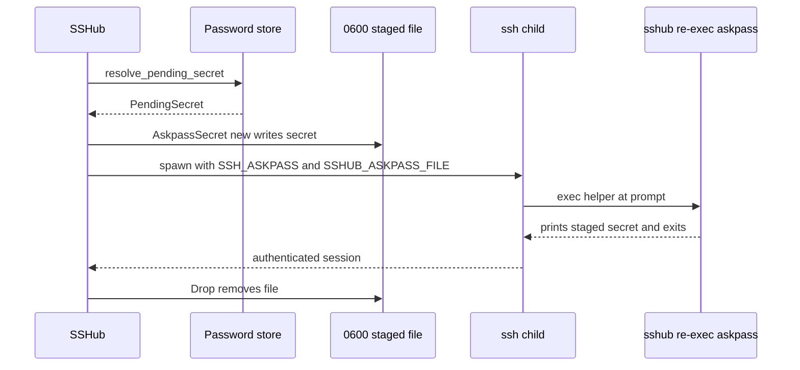

# Secrets & Security

## OS keyring (`src/credentials.rs`)

Host passwords and identity key passphrases live in the OS keyring through the `keyring` crate, service name `"sshub"`, keys `host:{id}` / `identity:{id}`. `PasswordStore` is the trait seam; `OsKeyring` in production, `NoopPasswordStore` in tests. SQLite stores only `has_password` flags — never secret material ([data model](../architecture/data-model.md)).

- **Profile namespaces:** `NamespacedPasswordStore` prefixes every key with `profile:<id>:` so identically named hosts in separate profiles never share a keyring entry; compatibility mode uses an empty prefix, so existing installs keep their current keys.
- `Cargo.toml` enables real backends (`apple-native`, `windows-native`, `sync-secret-service`, `crypto-rust`): without a backend feature, keyring 3.x **silently falls back to an in-memory mock** that works within one process but persists nothing — which "looks exactly like 'passwords aren't being saved'".
- On Linux this needs the D-Bus Secret Service (build: `libdbus-1-dev`; runtime: an unlocked gnome-keyring/KWallet or similar). `check_keyring_available` probes the service and treats an absent `org.freedesktop.secrets` as unavailable; without a provider, SSHub warns and ssh falls back to interactive prompting.
- [Termius import](../domain/hosts-identities.md#importing-hosts) re-stores imported secrets with write-verification (`store_credential_verified` sets the value and reads it back) and reports `keyring_failures` instead of dropping them silently.
- `sshub db purge` orphans keyring entries by design (only SQLite is wiped — the output says "Passwords in the OS keyring are left untouched"). Deleting a whole *profile* is the opposite: it captures the profile's namespaced `host:{id}` / `identity:{id}` keys and removes them from the store, but only after the filesystem deletion commits, so a failed delete can restore the profile completely.

### Plaintext fallback (`credentials.json`)

If Secret Service is unavailable, SSHub uses an owner-only plaintext `credentials.json` in the data directory, written through a `0600` temporary file (symlink refused) and atomic rename. The status bar reports the fallback rather than letting the user assume the keyring took the secret. When a keyring becomes available again, `migrate_fallback_to_keyring` moves the entries back on the next launch and removes the file **only after every entry succeeded**.

### Masked prefill, reveal/copy, cleared-field deletion

Secret fields in the host and identity forms arrive prefilled from the store and masked:

- `Ctrl+R` (`KeyAction::RevealSecret`) reveals and copies, `Ctrl+Y` (`KeyAction::CopySecret`) copies without revealing; both binds are rebindable and the form's hint row rides the password field while it is focused (`Ctrl+R: show + copy │ Ctrl+Y: copy`). Both actions report only that a value was copied — the notice names the secret ("password" / "passphrase"), never its value, and the value stays out of every log, audit row and diagnostic.
- Leaving the field re-masks it; the reveal bind is ignored away from the secret field.
- Saving compares the field against what the store held when the form opened (`password_original`), so a **cleared** field explicitly deletes the stored credential via `put_secret` — an empty field means "there is no secret any more", not "leave untouched".

## SSH_ASKPASS staging (`src/session/askpass.rs`)

Secrets reach ssh without appearing in argv or PTY history:

1. The secret is written to a fresh `0600` file (`sshub-askpass-{pid}-{n}`) under `$XDG_RUNTIME_DIR` (or the system temp dir).
2. The child process gets `SSH_ASKPASS=<path to the sshub binary itself>`, `SSH_ASKPASS_REQUIRE=force`, `SSHUB_ASKPASS_FILE=<path>`.
3. ssh re-executes sshub; `main.rs` calls `maybe_run_askpass()` **first** (before touching argv or the TUI), prints the staged secret, and exits.
4. The file is removed on Drop. Caveat: cleanup is Drop-based, so a `SIGKILL` can leave a stale staged file behind.

*The askpass handoff: the secret travels through an owner-only file and a self re-exec, never argv, env, or PTY typing.*

The same `helper_exe` + `AskpassSecret` mechanism feeds [tunnel](../workflows/tunnels.md) spawns (`stage_tunnel_askpass`), `sshub exec` and `sshub connect`, broadcast runs, and the OS auto-detect probe. `ssh-keygen -y` passphrase probing / generation (`src/ssh/keyfile.rs`) uses its own `KeygenAskpass` variant — a `0600` secret file plus a tiny `0700` helper script — explicitly because "`ps` would expose it" in argv.

`helper_exe()` re-resolves the helper path when an in-place upgrade replaces the running executable: `/proc/self/exe` reports `<path> (deleted)`, which is stripped and retried, so password authentication does not require a restart after `cargo install` / `npm install -g`. A genuine helper lookup failure is written to the session log ("SSH_ASKPASS unavailable — will type at the prompt") instead of surfacing as a misleading server-side rejection.

## Option-injection guards (0.14.2)

A host field starting with `-` is parsed by ssh as a *flag*, not a value: an address of `-oProxyCommand=id` built `ssh … -oProxyCommand=id`, and ssh ran `id` **locally** (issue #101). Addresses are written verbatim from imported PuTTY, Termius and mRemoteNG files, so a crafted export was local code execution on the machine that imported it — no typo of the user's own required. Two layers defend:

- **Connect-time backstop — `safe_ssh_target` (`src/ssh/host.rs`):** rewrites a leading-dash connection target into the `ssh://` URI form, which OpenSSH refuses outright instead of reading as an option; ordinary targets are untouched. Applied to every target sshub hands to ssh or mosh: managed/direct connects (`build_ssh_argv`), alias connects (`build_ssh_alias_argv`), mosh alias connects, and tunnel spawns (`build_tunnel_argv`). `ssh -- <host>` is not an alternative — the words after `--` become the remote command. A differential test drives the real `ssh -G`: the unguarded form still reports `proxycommand id`, the guarded one is refused outright.
- **Write-time refusal — `reject_option_like` / `is_option_like` (`src/store/hosts.rs`):** `create_host` and `update_host` refuse a leading-dash `name`, `address` or `username` with "starts with '-', which ssh reads as an option rather than a host — refusing to store it", so the poisoned row never lands and no later code path has to remember to defend. `is_option_like` is re-exported so the TUI host form can say so with the form still open ("{field} cannot start with '-' — ssh would read it as an option, not a host") instead of unwinding a store error through a key handler; `host add` goes through the same store guard.

**Importers drop only the poisoned entry:** a refused `create_host` is counted per-row (`skipped_invalid`), one diagnostic names the host, and the rest of the file still imports. The CLI summary prints `N skipped (refused: a field ssh would read as an option)` alongside the normal counts.

## Clipboard relay boundary

[Embedded sessions](../workflows/session-terminal.md) relay OSC 52 clipboard writes only from the session currently visible, and only while the feature is on. Empty payloads, clipboard reads, background tabs, and non-session views are refused or dropped; payloads and queue capacity are bounded, and the selector is normalized to the host clipboard. The full boundary — visibility gate, caps, drop counters, read refusal, selector normalization — is documented on the [session-terminal page](../workflows/session-terminal.md) rather than restated here.

What matters for this page: the feature defaults to on and can be disabled with `[clipboard] relay_from_pty = false`; a remote can never *read* the local clipboard; and because the sequence travels in the raw PTY stream, enabled session logs may contain it. The relay itself never puts a payload into any notice, diagnostic or log.

## Host-key policy

TOFU mirroring `accept-new` everywhere: ssh spawns inject `-o StrictHostKeyChecking=accept-new` **when a secret is staged** — embedded sessions and `sshub connect` (`prepare_session_connect_argv` / `prepare_cli_connect_argv`), tunnel spawns (together with `BatchMode=no`), the inner `ssh` of a mosh argv, and public-key push. The rationale is deadlock avoidance: with `SSH_ASKPASS_REQUIRE=force`, an unanswered host-key confirmation would send the fingerprint question to the askpass helper and get the password back instead of "yes". Changed keys are still refused. On the session side, a changed key is detected in the `-v` log and the user can opt in to purging the stale entry (spec computed as `[addr]:port` for non-default ports, plain `addr` otherwise).

<!-- openwiki: broken internal link [../workflows/sessions-sftp.md#sftp] heading anchor "sftp" does not exist in "../workflows/sessions-sftp.md". Fix the href or restore the target, then delete this comment. -->
[SFTP](../workflows/sessions-sftp.md#sftp) mirrors the policy over libssh2: an unknown key is recorded and accepted — appended to `~/.ssh/known_hosts` **manually**, because libssh2's writer rewrites the whole file and would drop unparsable lines (`@cert-authority`, `@revoked`, certificates) — while a **changed** key is a hard "possible MITM" error.

## Session logs capture secrets

<!-- openwiki: broken internal link [../workflows/sessions-sftp.md#session-logging] heading anchor "session-logging" does not exist in "../workflows/sessions-sftp.md". Fix the href or restore the target, then delete this comment. -->
[Session logging](../workflows/sessions-sftp.md#session-logging) is opt-in and captures **everything echoed to the terminal — including typed passwords**. The in-app help screen carries this warning ("captures all PTY output including secrets echoed on screen"); keep it in sync if logging behavior changes. The same raw-stream caveat is why the clipboard relay section above points at session logs.

## Filesystem permissions (`src/secure_fs.rs`)

Best-effort (Unix-only) hardening — `restrict_dir` sets `0700`, `restrict_file` sets `0600`, and a chmod failure never fails the caller. Applied to data/log/PID directories and secret-bearing files: the launcher and metadata databases (plus their directories, so SQLite sidecars stay owner-only), `credentials.json`, session logs, askpass staging files, tunnel PID files, completion caches, exported config directories, and profile migration staging. Non-Unix platforms compile to no-ops.

## Input-safety details worth preserving

- `src/ssh/export.rs::conf_val` flattens CR/LF in host fields so an exported `exported.conf` can't be used to inject a `Host *` stanza.
- Imports print nothing to stderr while the TUI is in raw mode (`src/ssh/import.rs`) — a diagnostic would corrupt the UI; failures are counted in the report instead.
- The `resolve` CLI subcommand (`cmd_resolve` in `src/cli/host.rs`, JSON shape `HostResolveJson` in `src/cli/output.rs`) exposes only `has_stored_secret`, never the secret; host records carry only the `has_password` flag.
- `sshub exec` writes an audit event with `via = exec` but **never records the command string** — it can carry a secret in an argument, and the audit log is not the place to keep one. (`--format json` echoes the command to the caller in its own `ExecRecord`; the boundary here is the shared audit table.)
