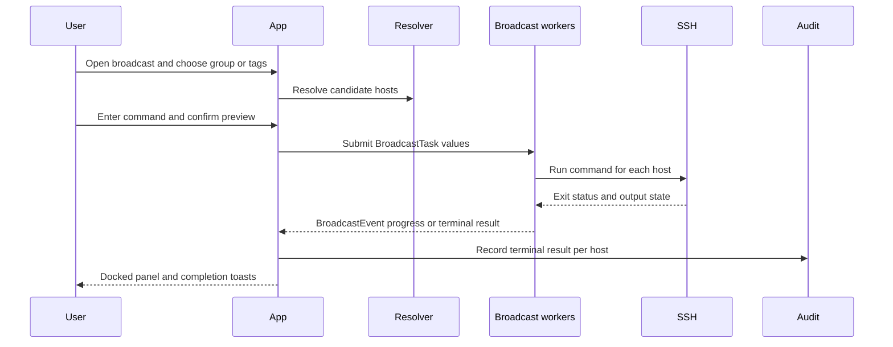

# Broadcast Commands

Broadcast is a TUI fleet-operation workflow: choose a group or tag target from the Hosts tab, enter a command, review the candidate hosts, then run the command concurrently without opening a separate session for each host. The implementation is split between the worker engine in `src/broadcast/mod.rs`, App-facing lifecycle glue in `src/app/broadcast.rs`, and rendering in `src/tui/screens/broadcast.rs`.

## Runtime flow

This sequence reflects the source-owned lifecycle: `spawn_broadcast` creates the worker pool, `tick_broadcast` drains events and folds results, and terminal results are audited once.

## Selection and execution

- `open_broadcast` refuses a new run when an existing run has non-terminal results. It also refuses when there are no groups or tags from which to select targets.
- The wizard uses `AppMode::BroadcastPickTarget`, `BroadcastCommand`, and `BroadcastPreview`. Candidate selection supports group/tag resolution and explicit editing before confirmation.
- `BroadcastTask` carries a resolved host and command. `SshCommandRunner` executes the command with the host's SSH resolution; the runner is abstracted so tests can use a fake.
- The worker pool uses `DEFAULT_CONCURRENCY`, shared task reception, and a cancellation flag. Events include started, output/progress, finished, failed, and cancellation outcomes; `apply_event` is the pure result-folding seam.
- The panel is docked in the dashboard and can be focused or zoomed. Finished runs remain visible briefly, then dismiss; result toasts expire separately.

## Audit and change safety

When all results become terminal, `tick_broadcast` writes audit records with `via = broadcast`, using the existing audit status vocabulary. Cancellation must flow through the same result-folding path so unfinished hosts become terminal and the audit write is not skipped.

Change the worker protocol in `src/broadcast/mod.rs` and update the focused suites in `src/app/tests/broadcast.rs`. Changes to selection or keyboard phases belong in `src/app/broadcast.rs` and `src/app/keys.rs`; visual/layout changes belong in `src/tui/screens/broadcast.rs` and `src/tui/mod.rs`. The narrow check is `cargo test broadcast`; use the full e2e target only when the change crosses general dashboard navigation or rendering behavior.

The feature is TUI-only: there is no `broadcast` headless CLI command or persistent broadcast table. It reuses host resolution and audit storage rather than introducing a new data model.

Related concepts: [runtime architecture](../architecture/overview.md) drives `tick_broadcast` each frame; the [TUI dashboard](tui.md) owns the wizard and panel; [data model and storage](../architecture/data-model.md) owns the audit records and host data.
