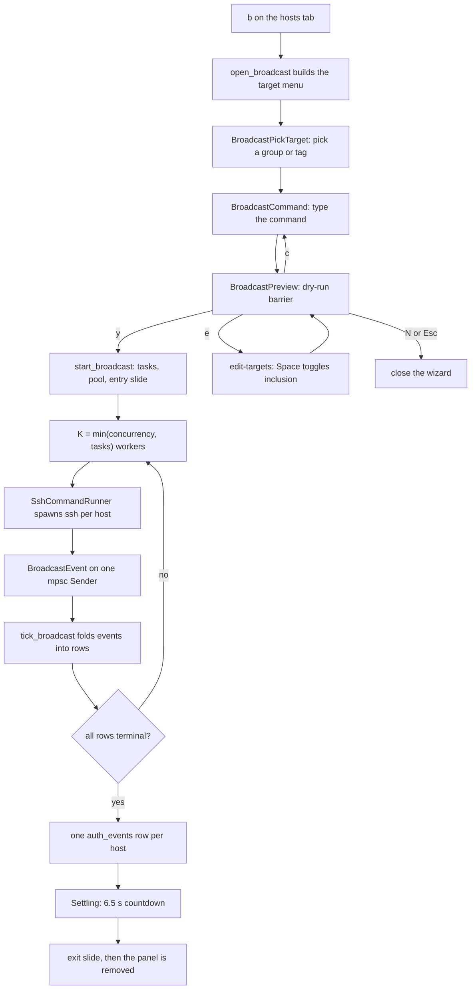
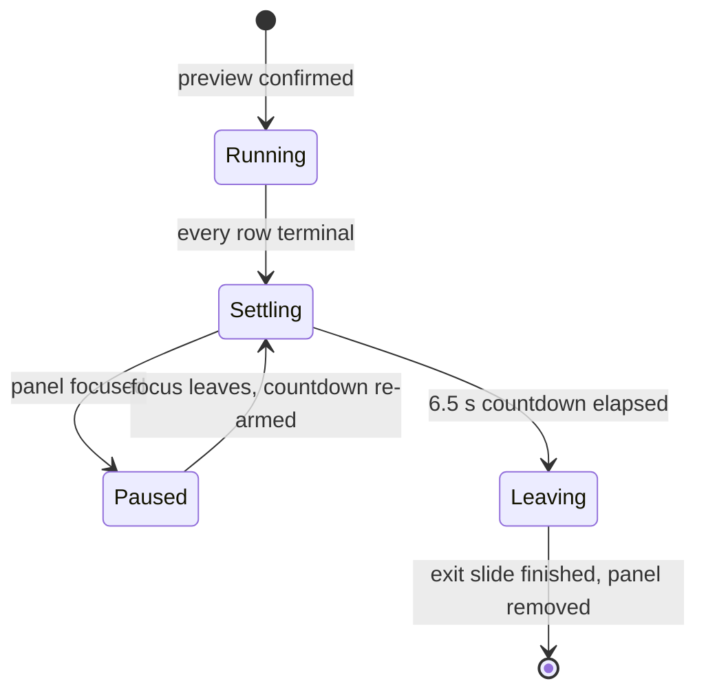

# Broadcast Mode

Broadcast mode turns fleet chores (check disk, restart an agent, read a version)
into one action: pick a group or tag, type one command, and run it
non-interactively on every target host concurrently, then read the aggregated
per-host result. `b` on the hosts tab opens the wizard; the run itself is a
**background job**, not a modal — once confirmed, the mode returns to `Normal`
and the user can switch tabs while it executes, watching progress in a docked
panel that floats over the dashboard. Like the rest of SSHub there is no async
runtime: the fan-out rides the crate's thread + `mpsc` worker shape
([background workers](../architecture/overview.md#background-workers)). The
feature is split into a **pure engine** (`src/broadcast/`) and **app wiring**
(`src/app/broadcast.rs`), with the render layer in
`src/tui/screens/broadcast.rs`.

*A broadcast run end to end: the wizard stages feed `start_broadcast`, which spawns the pure pool; the poll loop folds worker events until every row is terminal, then audits, counts down, and dismisses the panel.*

## The three-stage wizard (`src/app/broadcast.rs`)

`open_broadcast()` refuses to run while a previous run is still live (any
non-terminal row → the notice "A broadcast run is already in progress."); a
**finished** panel still on screen is not yanked — it is sent off with the exit
slide while the wizard opens over it. One broadcast runs at a time by design.
The target menu is built from the real user-group list (the reserved Favorites
group is deliberately excluded) plus the sorted, deduplicated set of host tags;
with neither, the wizard refuses with a notice.

The wizard rides three `AppMode` variants (`src/app/types.rs`):
`BroadcastPickTarget` → `BroadcastCommand` → `BroadcastPreview`. Each stage has
its own key handler in `src/app/broadcast.rs` and centered-popup renderer in
`src/tui/screens/broadcast.rs`:

1. **Pick target** — ↑/↓ move the highlight, `Enter` resolves the highlighted
   target and advances, `Esc` closes the wizard. Targets render as
   `group: <name>` / `#<tag>`.
2. **Command** — a single-line text input (char / backspace / cursor keys via
   `crate::text_input`, mirroring the SFTP prompt idiom). `Enter` advances only
   on a non-empty command; `Esc` steps back to the target picker.
3. **Preview barrier** — a dry-run summary ("Run `<cmd>` on N hosts
   (<target>):") with the full candidate list and the hint
   `[y] confirm   [e] edit targets   [c] edit command   [N] cancel`.
   `y` starts the run; `e` enters edit-targets mode (↑/↓ move the row cursor,
   `Space` toggles a host's inclusion, `Enter`/`e`/`Esc` return to the barrier);
   `c` returns to the command prompt with the cursor parked at the end and
   targets kept; `n`/`N`/`Esc` closes the wizard. The barrier protects against
   an accidental fleet-wide `reboot`/`rm`.

### Target resolution and credentials at pick time

`resolve_broadcast_candidates` maps the picked target to **managed hosts only**
(entries without a managed id are excluded), kept in host-list order, each
selected by default. Per candidate it captures `ssh_argv_for_entry(entry)`
(`argv[0] == "ssh"`, alias-only for ssh_config-sourced rows, full options for
launcher rows) and resolves the stored credential **now** —
`resolve_pending_secret` (`src/app/util.rs`), the same path
[connect](../domain/hosts-identities.md), detect, tunnels and the CLI use — so
password hosts authenticate via askpass instead of failing under `BatchMode`.

## The pure fan-out engine (`src/broadcast/mod.rs`)

The engine module is **pure** — no `App`, no TUI dependency — so it is testable
in isolation like `osinfo::detect`. It owns the shared value types
(`BroadcastTask`, `HostState`, `HostResult`, `BroadcastEvent`), the
`CommandRunner` transport seam, the real `SshCommandRunner`, the bounded pool
(`spawn_broadcast`), and the reducer/view helpers the UI drives.

- `BroadcastTask` — one host: `host_id`, `host_name`, `argv`
  (`ssh_argv_for_entry`), and `secret: Option<PendingSecret>`.
- `HostState` — `Pending | Running | Done { exit } | Failed { reason }`;
  `Done`/`Failed` are terminal.
- `HostResult` — one row of the aggregated table: identity, state, and the
  captured `stdout`/`stderr` (ephemeral — see [audit](#audit-contract)).
- `BroadcastEvent` — `Started { host_id }` (optional/leading) plus exactly one
  terminal `Finished { host_id, exit, stdout, stderr }` or
  `Failed { host_id, reason }` per task.
- `CommandRunner::run(argv, command, secret, cancel)` returns
  `Ok((exit, stdout, stderr))` for any completed exit code and
  `Err(reason)` for spawn failure, timeout, or cancel — the seam tests inject
  canned output through instead of spawning ssh.

### Bounded worker pool (`spawn_broadcast`)

`K = min(concurrency, tasks)` worker threads (clamped to at least one; the
app always passes `DEFAULT_CONCURRENCY = 8`) pull `BroadcastTask`s off a shared
`Arc<Mutex<Receiver<BroadcastTask>>>` and emit events on a single
`Sender<BroadcastEvent>`. The task channel is preloaded and its sender dropped,
so a worker's `recv()` never blocks — it returns a task or ends the thread once
the queue drains. With zero tasks the pool returns an already-exhausted
receiver and spawns nothing.

**Guarantee: exactly one terminal event per task**, including under cancel.
A worker that observes the cancel flag drains the rest of the queue marking
each remaining task `Failed { reason: "cancelled" }` without running it;
in-flight children are killed by the runner and surface as `Failed` too. A
runner that always errors cannot bring the pool down — every row simply ends
`Failed`. The senders are dropped when the workers exit, so the UI's drain loop
sees channel closure as "the run is over".

### Transport: `SshCommandRunner`

The real runner shells out to `ssh` with the same non-interactive option splice
as the OS-detect probe's `SshProbeRunner`: `-o BatchMode=…`,
`-o ConnectTimeout=N`, and `-o StrictHostKeyChecking=accept-new` right after
`argv[0]`, with the remote command appended as the final argv — inheriting
`~/.ssh/config`, ProxyJump, and the agent. There is **no PTY**. `ConnectTimeout`
(the constant is `CONNECT_TIMEOUT_SECS = 8`) bounds only the TCP connect; the
run itself is capped by `RUN_TIMEOUT = 60 s` and honored cancel via a
`try_wait` poll loop that wakes every 50 ms (`POLL_INTERVAL`) and kills the
child on cancel or timeout. stdout/stderr are drained on their own threads so a
chatty host cannot deadlock the other pipe; killing the child closes the pipes
and the readers join afterwards. Any completed exit code is a `Finished`
payload — a non-zero exit is a *failure* only in the view/audit layer
(below), not an `Err`.

### Auth: `BatchMode` vs. a stored secret

The split is per task, resolved when the target was picked:

- **No stored secret** (`secret: None`): `BatchMode=yes` — key/agent auth only,
  failing fast instead of blocking on a `/dev/tty` password prompt the
  non-interactive spawn could never answer.
- **Stored credential** (`secret: Some`): `BatchMode=no`, and the runner stages
  the secret through the exact `SSH_ASKPASS` path a live session uses —
  `session::askpass::helper_exe()` plus an `AskpassSecret` guard (a `0600`
  secret file removed on drop; env `SSH_ASKPASS` / `SSH_ASKPASS_REQUIRE=force` /
  `SSHUB_ASKPASS_FILE`) — see [secrets](../security/secrets.md). The guard is
  held for the whole poll loop so the file outlives the child. A unit test
  pins that only hosts carrying a secret hand one to the runner.

### Reducer and view helpers

`apply_event` is the pure `BroadcastEvent → rows` fold: it mutates the matching
row (by `host_id`) in place, leaving length and order untouched — `Started` →
`Running`, `Finished` → `Done { exit }` + captured output, `Failed` →
`Failed { reason }`. A stray late `Started` never resurrects a terminal row,
and unknown host ids are ignored. `all_terminal` / `done_count` drive the
settle countdown and the `N/total` header badge.

The **failures-first ordering is a render-time view, not a mutation**:
`failures_first` returns indices sorted by `state_rank` with a stable sort
(`Failed` and non-zero-exit `Done` rank 0, `Running` 1, `Pending` 2, clean exit
3; ties keep input order). A non-zero exit code counts as a failure — the
remote command ran but reported an error — which is also what `is_failure`,
`failure_count`, and `error_text` (the ssh failure reason, or the first
non-empty stderr line for a bad exit) feed.

## The docked live panel (`src/tui/screens/broadcast.rs`)

On `[y]`, `start_broadcast` builds tasks from the selected candidates, spawns
the pool with `SshCommandRunner::new()`, seeds one `Pending` row per task in
task order (`seed_results`), and arms the entry animation: a `SlideAnim` from
`spawn_rect` (centered over the dashboard body) to `docked_rect` (the
bottom-right corner) over `ENTRY_ANIM = 600 ms` with an ease-out curve
(`src/tui/tween.rs`). Under reduced motion the panel simply sits at its docked
rect. The panel deliberately starts **unfocused** — focusing would immediately
pause the completion countdown (focus means "the user is reading it"), so it
would never auto-dismiss.

The panel is registered in the issue #18 focus ring as `PanelId::Broadcast`:
`Alt`+arrows reach it from the ping panel (right) and the ssh-log strip
(right), and hop back left/up; `focus_panel` skips hops onto it while no run is
live. The footer advertises `x cancel` while a run is live and `z zoom` once
focused. `z`/`Alt+Enter` zooms it full-body — the zoomed view shows a
failures-first host list (~55% height, selected row reverse-highlighted, scrolled
through the shared `zoom_window` scaffolding) above the selected host's
`stdout:`/`stderr:` detail panes. Unlike other panels, the zoom morph animation
is skipped for Broadcast (it has its own slide path), and the hosts-grid zoom
dispatcher deliberately leaves the zoomed Broadcast to `render_inner`'s own
block because it has no home in the bento grid.

The docked panel draws the header `cast: <command> · <target>` with a
`N/total` completion badge (plus `✗<fails>` when anything failed), per-host
rows in `failures_first` order (glyph, host name, status label, and a dim
failure-detail column), an overflow `…` marker when hosts exceed rows, and a
thin countdown gauge along the bottom while settling.

### Panel lifecycle (`BroadcastPhase`)

*The docked panel's phases in `BroadcastPhase`; the per-host rows fold through `HostState` independently of this panel lifecycle.*

`Running` ends when `all_terminal` holds, which arms `Settling { done_at }` —
the auto-dismiss countdown (`DISMISS = 6.5 s`, drawn as a depleting bar with a
`dismiss Ns` label). **Focusing the panel pauses the countdown** (`Settling` →
`Paused`); unfocusing re-arms it with a fresh timestamp. When the countdown
elapses, `slide_broadcast_out` plays the exit slide (dock → fully off the right
edge) into phase `Leaving`, and `tick_broadcast` removes the panel once the
slide ends — stamping `broadcast_panel_gone_at` so lingering toasts animate
*down* into the freed space instead of jumping. Opening the wizard over a
finished panel reuses the same exit slide.

### Cancel and error toasts

`x` (`KeyAction::BroadcastCancel`, default binding `x` in `src/keybinds.rs`) is
claimed before any other binding in `handle_key_normal` and works regardless of
focus: with a live run it calls `cancel_broadcast`, which sets the shared
`AtomicBool` — workers kill in-flight children and mark the rest
`Failed{"cancelled"}`, which the next tick folds in; with no run but lingering
toasts it clears the toasts. `open_broadcast`'s one-run-at-a-time refusal also
surfaces as a notice toast.

Every failed host spawns an error toast (`BroadcastToast`): for a non-zero exit
the trimmed full stderr (or `exit N` when stderr is empty), for an ssh-level
failure the runner's reason. Toasts slide in from the right above the docked
panel, hold for `TOAST_TTL = 10 s`, then slide out over `TOAST_ANIM = 300 ms`;
the boxes size to their wrapped text (capped at 6 lines) and wear the same
error color as the row that produced them. They can outlive the panel: expiry
runs in every tick even with no broadcast, and once the panel is dismissed the
stack re-anchors into the vacated bottom-right, animating down over
`TOAST_ANIM` from `broadcast_panel_gone_at`.

## Poll-loop integration

`tick_broadcast` is called once per event-loop frame
(`src/lib.rs`, after the other worker drains — see
[runtime architecture](../architecture/overview.md)). Each tick it:

1. expires finished toasts (before the `broadcast.is_none()` early return, so
   toasts outliving the panel still animate out);
2. drains `BroadcastState.rx` with `try_recv`, folding each event through
   `apply_event` and spawning a toast per failure;
3. retires the entry slide once done and arms `Settling` on the first tick
   every row is terminal;
4. writes the audit trail (exactly once, below);
5. drives the `Settling`/`Paused`/`Leaving` countdown and dismissal.

While any broadcast-driven motion is in flight — the entry slide, a toast's
slide-in/out, the post-dismissal stack drop, or a zoom morph —
`App::animating` reports true and `poll_keys_and_watcher` shortens its poll
window from 50 ms to 16 ms, so the ~600 ms entry slide renders at ~60 fps
instead of stepping at the idle 20 fps cadence.

## Audit contract

At completion — the first tick `all_terminal` holds, guarded by
`BroadcastState.audit_written` so a second tick can never duplicate rows — the
run writes **one `auth_events` row per host** through the same
`store.log_auth_event` the connect/session paths use, with
`via = "broadcast"` and no username. Broadcast is audited exactly like
connects, in the canonical status vocabulary so the rows integrate with the
audit tab's Ok/Fail filters, the stats query, and `theme::status_color`:

- clean exit → status `launched`, note `<command> (exit N)`;
- non-zero exit → status `fail`, note `<command> (exit N: <first stderr line>)`
  via the shared `error_text` helper;
- ssh-level failure → status `fail`, note `<command> (<reason>)` — including
  `"cancelled"` when the user aborts.

Full stdout/stderr is deliberately **ephemeral** in v1 — captured live in
`HostResult`, visible in the panel and zoomed view, but not persisted; the
audit row carries only the one-line note.

## Tests

- **Engine invariants** (`src/broadcast/mod.rs` `#[cfg(test)]`, fake
  `CommandRunner`): bounded concurrency (`peak ≤ K`), workers clamped to the
  task count, empty task list yields no events, exactly one terminal event per
  task, cancel-before-start marks everything terminal `Failed{"cancelled"}`,
  an always-failing runner never panics the pool, reducer transitions preserve
  row order and never resurrect terminal rows, stable failures-first ordering,
  `failure_count` includes non-zero exits, and the real runner reports spawn
  failure / short-circuits on pre-cancel / receives the per-task secret.
- **App wiring** (`src/app/tests/broadcast.rs`): the wizard group/tag flow
  (pick → command → preview → `e`/`Space` deselect → `n` closes), the wizard
  refuses to open over a live run, `tick_broadcast` folds events, arms
  `Settling`, and writes the audit rows exactly once with the right
  status/note, `cancel_broadcast` flips the shared flag, and the live panel
  renders through `tui::render` wearing the theme's
  `components.broadcast.error` role for a failed host.
- **E2E** (`tests/e2e/broadcast.rs`): drives the wizard through the real key
  handlers into a rendered `TestBackend` buffer, asserting the "Broadcast to"
  menu, the echoed command, the resolved host list, and the `[y]`/`[e]`/`[N]`
  barrier — and deliberately **stops before `y`**, which would spawn real ssh;
  everything up to the barrier is pure UI.
- **Render layer** (`src/tui/screens/broadcast.rs` tests): the docked panel and
  zoomed view wear the `broadcast.panel` role bundle in both focus states, plus
  countdown/toast/row-color coverage.

## Change guidance

- New pool behavior belongs in `src/broadcast/mod.rs` behind `CommandRunner`;
  keep the module free of `App`/TUI deps and pin new invariants with fake
  runners, not real ssh.
- The one-terminal-event-per-task guarantee and the audit-once guard are the
  two invariants easiest to break silently — both have dedicated tests; keep
  them green when touching `spawn_broadcast`, `apply_event`, or
  `tick_broadcast`.
- The wizard is three `AppMode` variants + three key handlers + three render
  functions; stage transitions must keep `broadcast_setup` and the mode in
  sync (the e2e test pins the whole walk).
