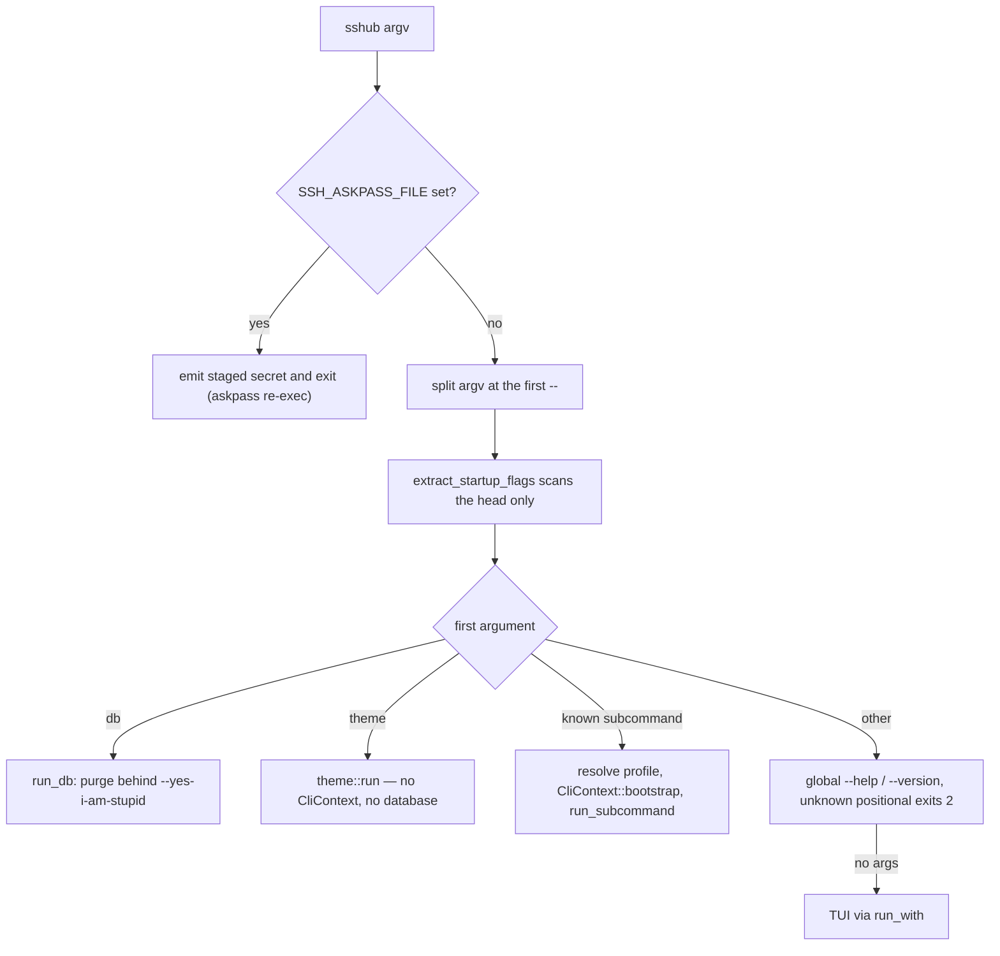

# Headless CLI

Beyond the TUI, `sshub` exposes a full scriptable CLI. `CliContext::bootstrap()` (`src/cli/context.rs`) loads config, opens both databases, builds the resolver and the password store (OS keyring with file fallback), and loads merged hosts — so the CLI shares all state with the TUI ([data model](../architecture/data-model.md)). Parsing is hand-rolled (`src/cli/parse.rs`, no clap); JSON/plain DTOs live in `src/cli/output.rs`.

## Dispatch order (`src/main.rs`)

`main` runs the gates below in a fixed order; getting them wrong changes what a script observes:



The dispatch above shows the exact main.rs sequence:

1. **askpass re-exec** — if ssh re-executed the binary as its `SSH_ASKPASS` helper (`SSHUB_ASKPASS_FILE` in the environment), the staged secret is printed and the process exits before argv is ever parsed, so the TUI/CLI never sees that invocation.
2. **profile flags with `--` held back** — `--profile NAME` / `--manage-profiles` are extracted by `profile::extract_startup_flags` before dispatch so they work for both the TUI and headless commands. Everything after the first `--` (a remote command such as `sshub exec web -- aws --profile prod s3 ls`) is split off first and re-appended untouched: otherwise the scan would swallow the remote tool's flags and fail with "unknown profile" or silently drop a flag. `--profile` combined with `--manage-profiles`, or used in compatibility mode (directory overrides), is rejected.
3. **`db`** — handled directly in `main.rs` (unknown `db` subcommand or missing one exits 2).
4. **`theme`** — dispatched *before* `is_subcommand`/`CliContext::bootstrap`: theme commands are headless by contract, so validating a draft never opens the launcher and metadata databases (see below).
5. **other subcommands** — `cli::is_subcommand` is a cheap string check with no bootstrap; only a match leads to profile resolution + `CliContext::bootstrap` + `cli::run_subcommand`. `sshub <cmd> --help` reaches the per-command help here instead of the global help.
6. **global flags / TUI** — only when no subcommand was given: `--help`, `--version`, an unknown non-flag first arg (exits 2 with a hint instead of launching a full-screen TUI on a typo), `--dry-run` (exit 0 immediately, smoke/CI), then the TUI.

Headless invocations never show the profile picker: without `--profile` the last-used profile is used; an unknown `--profile` name fails with the list of available profiles.

## Conventions

- `--format plain|json` on listing/show commands (plain default). The flag is parsed by scanning the whole arg list, and `theme show` deliberately uses its own `toml|json` set (there is no `plain`, because `show` writes a document, not a report).
- Exit codes: `0` success, `1` operational failure, `2` usage/bad flags, `124` when `exec --timeout` kills the run. `host connect` and `exec` propagate the child ssh exit code (ssh's own failures keep 255); a usage error comes from `parse::usage`, which exits 2.
- Destructive commands refuse without `--yes` (`host delete`, `group delete`, `identity delete`, `tunnel delete`, `sftp rm`); `sshub db purge` requires `--yes-i-am-stupid`. Refusals exit 1 before doing any work.
- Unknown positional first arg exits 2 with a hint (avoids launching a full-screen TUI on a typo).
- `--password-stdin` flags read secrets from stdin (trailing newline stripped) rather than argv; `exec` never records the remote command in the audit log because it can carry a secret in an argument.

## Command tree

| Command | Subcommands | Notes |
|---|---|---|
| `host` (aliases `list`, `connect`) | `list show connect resolve search add edit rename delete duplicate` | `add` takes `--name --address --port --username --group --tags` plus label/identity/proxy-jump/remote-command/transport/session-log/favorite/`--password-stdin`; `connect` runs ssh/mosh as a foreground child process with inherited stdio (Command::spawn + wait), propagating its exit code and updating `last_connected`; it does not go through the TUI's PTY session module (`src/session/mod.rs`, `Session::spawn`), so there is no transcript unless session logging wraps the argv in `script(1)`. `host add`/`host edit` refuse a `name`/`address`/`username` starting with `-` (see [option-like refusal](#option-like-values-are-refused-at-the-write)) |
| `exec` | — | `sshub exec <host> [--tty] [--timeout SECS] [--format plain\|json] -- <command>`: one non-interactive command on a saved host (`src/cli/exec.rs`), detailed below |
| `group` (alias `groups`, forwards flags) | `list show add edit delete` | Nested groups via `--parent`; `list` hides reserved groups unless `--all`; delete requires `--yes` |
| `identity` | `list show add edit delete agent-remove` | `add --private-key`, `--certificate`, `--password-stdin` for secrets (the piped password is read before the row is created, so an empty secret never sets `has_password`); `agent-remove` = `ssh-add -d` for the identity's key |
| `tunnel` | `list show create start stop delete` | `start` is detached by default (PID files under the profile tunnel dir), `--foreground` runs with the keep-alive reconnect loop ([tunnels](tunnels.md)); `<id>` accepts a tunnel id, label, or local port (ambiguous matches are an error); delete requires `--yes` |
<!-- openwiki: broken internal link [sessions-sftp.md#sftp] heading anchor "sftp" does not exist in "sessions-sftp.md". Fix the href or restore the target, then delete this comment. -->
| `sftp` | `ls get put rm mkdir rename chmod` | One-shot over a direct host via the background SFTP worker; no ProxyJump ([sessions & SFTP](sessions-sftp.md#sftp)); `rm` is destructive and requires `--yes` |
| `audit` | `list stats` | `--status ok|fail|retry`, `--days N`, `--via all|connect|tunnel|agent|exec` (`connect` means interactive connects only — the store's filter is `via NOT IN ('tunnel','agent','exec')`), `--host`, `--limit` (default 50); `stats` counts ok/fail over `--days` (default 30) and only shows `retry` with `--include-retry` |
| `tags` | — | List all tags |
| `theme` | `check list show` | Headless by contract — no TUI, no database, no user-state writes (see below) |
| `import` / `sync` / `export` | — | Multi-format import, ssh_config row refresh, `export --stdout|-o` (see below) |
| `completions` | `bash zsh fish` | `--cache PATH` writes/reads a host-name cache; installed by `just install-completions` |
| `db` | `purge` | Deletes `launcher.db` + SQLite sidecars only (`-wal`, `-shm`, `-journal`) |

Examples (from `README.md`):

```bash
sshub host add --name prod-web --address 10.0.0.5 --port 22 --username deploy --group prod --tags web,prod
sshub tunnel create --host prod-web --type local --local-port 8080 --remote-host localhost --remote-port 80
sshub sftp get prod-web /var/log/app.log ./app.log
sshub exec prod-web --timeout 30 -- systemctl is-active nginx
sshub audit list --status fail --days 7
```

Per-command help: `sshub <command> --help` prints a USAGE block scoped to that command (`src/cli/help.rs`); for `exec` only the part before `--` is scanned, so a remote command's own `-h` is not mistaken for a help request. The man page (`man/sshub.1`, preview with `just man`) covers the same surface.

### `exec` — one scripted command on a saved host

`sshub exec <host> -- <command>` reuses the connect argv (`session_argv_for_entry` + `prepare_cli_connect_argv`, so stored identity, credential and ProxyJump apply), then adjusts it (`exec_argv`):

- `-T`/`-tt`: no PTY by default; `--tty` forces one for full-screen commands (vim, top, less) or `sudo` without NOPASSWD.
- `-o RemoteCommand=none`: a stored remote command must not win. Launcher-managed hosts carry one as a trailing `-- <cmd>` in the argv, which is truncated off; an `ssh_config`-level `RemoteCommand` would otherwise make ssh refuse the run outright ("Cannot execute command-line and remote command", exit 255), so the option clears it.
- `-o BatchMode=yes` only when no stored secret is staged: without a secret nothing can answer a prompt (ssh reads prompts from `/dev/tty`, so redirecting stdin does not save a script), but BatchMode would switch the askpass helper off.

Operational contract:

- stdio passes through, stdin is inherited in both modes (`echo payload | sshub exec db -- 'psql -f -'` works); the exit code is the remote command's.
- Shell operators belong to whichever shell reads them: a bare `&&` splits locally (`sshub exec web -- ls && uptime` runs `ls` on the host and `uptime` at home — the same as `ssh`); quote the whole thing to send it remotely: `-- 'ls && uptime'`. The quoted form is one argv word after `--`, covered by unit tests and documented in `--help`, the man page and the README since 0.15.2. A full-screen command needs `--tty`.
- `--timeout SECS` mirrors `timeout(1)`: the run is spawned into its own process group and the group is SIGKILLed at the deadline, exiting `124`. The group exists only when a timeout was asked for (otherwise Ctrl-C would stop reaching ssh). Killing the whole group matters because a `ProxyJump` helper (`ssh -W`) inherits the pipes and would keep `--timeout` from ever returning. The local ssh is what gets killed — a remote command started without a PTY can outlive the connection.
- `--format json` buffers the run as `{host, command, exit_code, stdout, stderr, duration_ms}` (piped stdout/stderr drained on their own threads so a chatty command cannot deadlock the timeout poll; stdin stays inherited; lossy UTF-8; a spawn failure still emits a record). Plain streams.
- Never prompts, no session transcript (`script(1)` wrapping fights redirection — use `sshub connect` for one), mosh hosts are refused (no one-shot command mode). Audited as `via exec` without the command string.
- Unknown exec flags before `--` are usage errors (exit 2) rather than silently vanishing; `--timeout` requires a whole-second value ≥ 1.

### `theme` — headless by contract

`sshub theme check|list|show` are the only CLI commands that run entirely without a database. `main.rs` dispatches them before `CliContext::bootstrap`, and the commands resolve the themes directory through the read-only `config::config_dir_path` (never `config_dir()`), so asking which themes are installed never creates `~/.config/sshub`, migrates a legacy tree, or touches user state — no `config.toml`, no activation, no file in the themes directory. All validation lives in `crate::theme`; `src/cli/theme.rs` only picks the validation mode and renders.

- `theme check <file>` — strict validation (`ValidationMode::Strict`: an unknown role is an error, not a compatibility note) with the same parser/resolver the app uses. The file's own directory stands in for the themes directory, so a portable package whose child inherits from a sibling can be checked as the package it is; a parent that came from a sibling is a warning, because installing the child alone would leave it unresolvable. Diagnostics render as `file:line:column severity: message` (1-based line/column computed from the byte span in the user file's own text) with a `help:` line, including `did you mean \`terminal\`?`-style suggestions: the validator Levenshtein-matches unknown keys/values/role paths against the catalogue with a length-proportional near-miss budget and stable lexicographic tie-breaking. Exit codes: `0` valid (warnings allowed), `1` validation or file error, `2` wrong usage. Plain output escapes C0/DEL control characters from user-authored names (`\u{001b}`-style), and JSON is escaped by serde.
- `theme list` — Compatible-mode registry, exactly what the running app would build. Lists *every* record, including invalid themes and user files that collide with a reserved built-in id (never filtered), plus directory-level diagnostics; a readable themes directory always exits 0, an unreadable one exits 1.
- `theme show <id>` — `--format toml|json`. Without `--resolved` the theme file is printed verbatim, comments included (the documented copy workflow: `sshub theme show aqua > ~/.config/sshub/themes/aqua-custom.toml`, then `theme check` it); an unknown or invalid id exits 1. With `--resolved` a standalone document is written instead: no `extends`, no references — every semantic slot, gradient (named, with synthetic names for nameless gradients) and component role written out with `toml_edit`-escaped strings and quoted keys, so re-reading the file yields the same runtime theme (round-trip tested for semantic equality).

### `import` / `sync` / `export`

- `sshub import [--from ssh|termius|putty|mremoteng] [--dry-run] [PATH]` — `ssh` (default) imports `~/.ssh/config`; PATH is ignored and `--dry-run` is *not supported* for it (refusal exits 1). `termius` takes an export directory containing `L00t.csv` (auto-detected default), `putty` a `.reg` file or a sessions dir (default `~/.putty/sessions`), `mremoteng` a `confCons.xml` (PATH required). `--dry-run` parses and previews the hosts (`name  user@host:port` lines plus a count) without writing anything for the other three sources. Only SSH sessions are imported (RDP/VNC/telnet skipped); encrypted mRemoteNG passwords are not decrypted. An unknown `--from` exits 2.
- `sshub sync` — refresh the ssh_config-derived rows in the database, then reload the merged host list.
- `sshub export [--stdout] [-o PATH]` — render launcher hosts as an ssh_config snippet. `--stdout` and `-o` are mutually exclusive; without either, the file lands beside the profile's `config.toml`.

### Option-like values are refused at the write

`name`, `address` and `username` all end up in the connection target, and a value starting with `-` is parsed by ssh as a flag (an address of `-oProxyCommand=id` would run `id` locally — issue #101). `create_host` and `update_host` therefore reject option-like values (`host add` surfaces this as a nonzero exit), and every importer refuses such a row too: one poisoned entry does not cost the rest of the file — the summary counts it as `skipped (refused: a field ssh would read as an option)` and the message names the skipped host. At connect time a legacy stored target is additionally neutralised into the `ssh://` form, which OpenSSH refuses loudly instead of parsing as a flag.

## Change guidance

- New subcommand: register in `src/cli/mod.rs` (`is_subcommand` + `run_subcommand`; note `db` and `theme` are dispatched in `main.rs` *before* this list — a `theme`-style database-free command needs its own arm there), add a module under `src/cli/`, add its help block in `src/cli/help.rs` and the section in `main.rs::print_help`, list it in `src/cli/completions.rs` (`TOP_LEVEL` plus the bash/zsh/fish bodies — one test per shell asserts the generated scripts offer the subcommands), extend the man page, the README table and this page.
- Keep exit codes stable; scripts depend on them. New usage errors go through `parse::usage` (exit 2) unless the command owns its codes like `theme`.
- CLI smoke coverage lives in `tests/smoke/cli_commands.rs` (drives the real binary via `assert_cmd`, hermetic through `SSHUB_DATA_DIR`/`SSHUB_CONFIG_DIR`/`SSHUB_SSH_CONFIG`) — see [testing](../testing/strategy.md), which points CLI changes at that file. Add an `exec`-style isolation test when a command interacts with global argv scanning or dispatch order.
