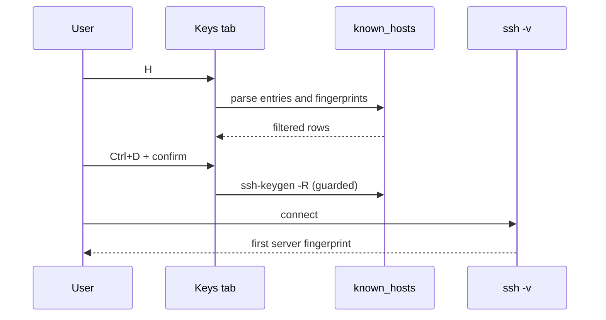

# Known Hosts Manager and Host-Key Verification

The Keys tab opens the known-hosts manager with `H`. It reads `~/.ssh/known_hosts` and presents the host (or `(hashed)`), optional `@cert-authority` / `@revoked` marker, key type, and `SHA256:` fingerprint. Filtering searches host and fingerprint text; `Ctrl+R` refreshes from disk.

Deletion is deliberately narrower than display. After confirmation, `Ctrl+D` invokes `ssh-keygen -R` for a host, but refuses hashed entries, marker rows, wildcard rows, and a plain deletion that would also remove a matching wildcard. This avoids turning a convenient cleanup action into an accidental trust-policy change.

During connection, the `-v` stream supplies the server host-key fingerprint to the connecting screen. SSHub caches the first fingerprint it sees, so later banner output cannot replace the value that the user should compare. Changed-key handling remains a separate connect-time decision: the existing prompt can purge a stale entry and retry.

The overlay and fingerprint flow are implemented in `src/known_hosts.rs`, `src/tui/screens/known_hosts.rs`, `src/app/keys.rs`, and `src/session/mod.rs`. Loading and refresh errors are shown as overlay diagnostics; fingerprint parsing handles inline key comments independently. Editing refuses symlinked `known_hosts` files and negated-pattern rows. Keep `src/app/tests/keybind.rs` and known-host tests aligned when changing bindings or deletion guards. Quoted `Host` aliases are normalized by `src/ssh/resolver.rs` before `ssh -G`; the differential resolver coverage is described in `docs/oracle-tests.md`. The broader [hosts and identities model](../domain/hosts-identities.md) owns identity and host relationships; [secrets and security](../security/secrets.md) owns the general trust and credential policy.
