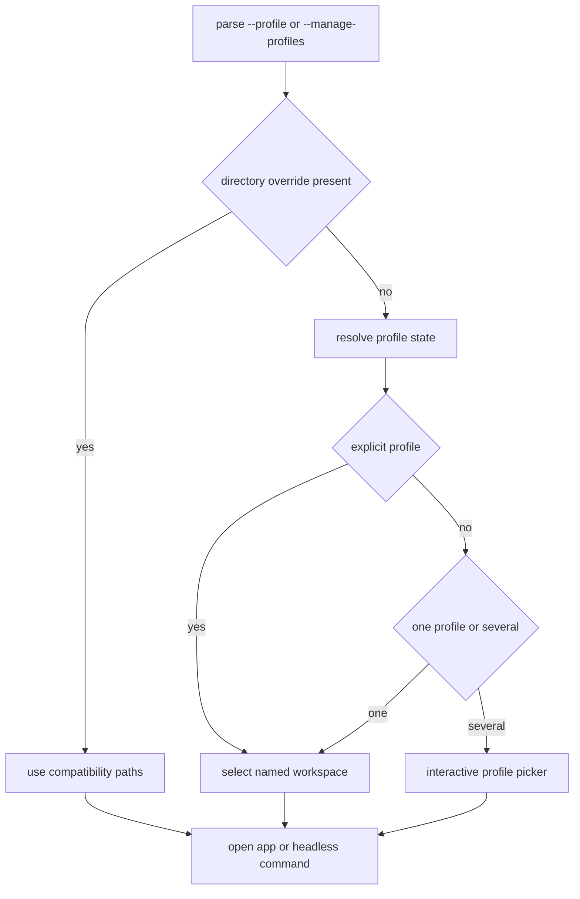

# Isolated Profiles and Startup Selection

Use this page when changing startup flags, data paths, profile CRUD, profile-specific SSH configuration, or legacy installation migration. `src/profile/mod.rs` resolves a `ProfilePaths` workspace before the database or TUI is opened; `src/lib.rs` then constructs `App::new_with_profile`, while `src/main.rs` resolves a profile silently for headless commands.

## Workspace and selection

The installation root contains `state.toml` and `profiles/<name>/`. Each profile directory owns `launcher.db`, `metadata.db`, `config.toml`, session logs, tunnel runtime state, and profile-specific fallback credentials. A profile has a stable ID separate from its display name so renaming does not change credential namespaces. Its SSH config source is selected from the environment override, profile `[ssh].config_path`, or the shared `~/.ssh/config` fallback.

Startup behavior is deterministic: `--profile NAME` selects directly; `--manage-profiles` forces the picker; one profile launches silently; multiple profiles show `ProfilePicker` after the splash. Headless CLI commands use the last-used profile and never show the picker. `SSHUB_DATA_DIR` and `SSHUB_CONFIG_DIR` retain compatibility mode, using override directories verbatim and rejecting profile selection.

This flow shows why profile selection precedes database bootstrap and why headless commands bypass the picker.

## Migration and lifecycle safety

`src/profile/migrate.rs` moves legacy top-level data into `profiles/default` through a staging directory, writes the stable profile ID, rekeys profile-owned credentials, and writes `state.toml` only after the destination is complete. Interrupted staging is swept on retry. Existing profile directories can be adopted when state is absent. Profile creation seeds a config; rename moves the directory and updates state with rollback handling; deletion stops profile tunnels, stages the directory, updates state, then removes profile-namespaced credentials. The final profile is never deletable.

## Change guidance

Keep path derivation centralized in `ProfilePaths`; do not let feature code reconstruct profile directories. When adding a profile-owned resource, add it to `ProfilePaths`, startup construction, migration/adoption behavior where relevant, and a profile isolation test. When changing startup flags, update both `src/profile/mod.rs` and `src/main.rs`, plus CLI smoke coverage. The [data model](../architecture/data-model.md) documents database ownership; [secrets](../security/secrets.md) documents credential fallback and namespace behavior; [TUI dashboard](tui.md) owns the interactive settings and picker entry points.
