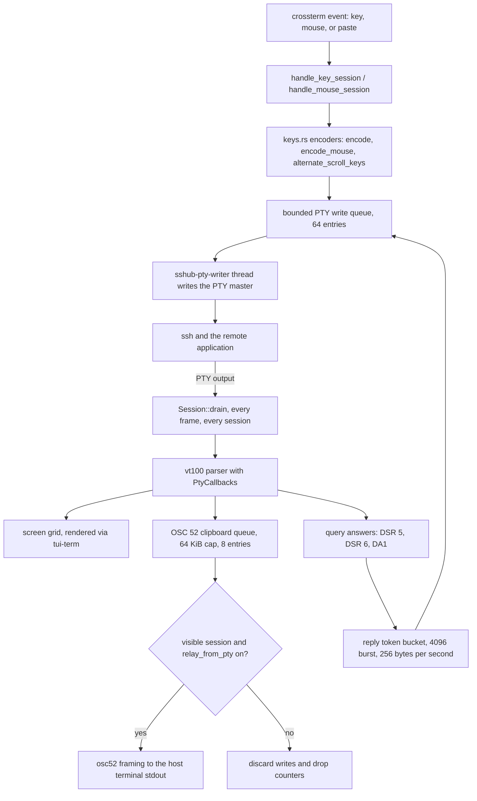

# Embedded Terminal Surface — Keys, Mouse, Queries, and Clipboard

Because SSHub renders the remote PTY itself instead of handing the screen to an
external terminal (see [embedded sessions](sessions-sftp.md)), SSHub *is* the
terminal as far as the remote application is concerned. Everything an app inside
the PTY expects a terminal to do — encode keystrokes, route the mouse, answer
status queries, honor an OSC 52 copy — has to exist inside SSHub, and it lives
in four pieces of `src/session`:

- **`keys.rs`** — outbound encoding: crossterm `KeyEvent`s and `MouseEvent`s to
  xterm byte sequences, plus the mouse-routing decision.
- **`parser.rs`** — the `vt100` parser wrapper whose `PtyCallbacks` collect OSC
  52 clipboard writes and synthesize answers to terminal queries that `vt100`
  itself does not implement.
- **`mod.rs`** — the `Session` methods that turn those artifacts into PTY
  writes (query replies through a token bucket) or host-terminal writes (the
  clipboard relay), plus selection and the guarded scroll path.
- **`osc52.rs`** — the single place OSC 52 sequences are framed, shared with
  SSHub's own copy shortcuts.

The [event loop](../architecture/overview.md) drives all of it once per frame:
every session's PTY is drained (`Session::drain`), then the OSC 52 relay pass
runs for the visible session, then input events are dispatched — keys and
pastes to `App::handle_key_session`, mouse to `App::handle_mouse_session`
(`src/app/session.rs`).

*The in-band round trip: outbound keystrokes, mouse reports and query answers share one bounded PTY write queue; inbound PTY bytes feed the grid, the clipboard queue and the synthesized query replies.*

## Key encoding (`src/session/keys.rs`)

`encode(key, application_cursor)` translates one crossterm key event into the
bytes a remote xterm-compatible shell expects: printable characters (Alt
prepends ESC, Ctrl maps a-z to control codes xterm-style), Enter as `\r`,
Backspace as DEL, Tab / BackTab, Esc, PgUp/PgDn, Insert/Delete, F1–F12, and
modifier combinations. Events with no meaningful encoding — modifier-only
presses, key releases on platforms that report them — yield `None`.

The `application_cursor` flag is the remote's **DECCKM application-cursor
mode**, read from the session's own vt100 screen right before encoding
(`screen().application_cursor()` in `handle_key_session`). When the remote has
requested it, unmodified arrows, `Home` and `End` are sent as SS3 sequences
(`ESC O A` …); otherwise as the normal CSI form (`ESC [ A`). Modified cursor
keys always use xterm's parameterized CSI form (`ESC [ 1;{param}{key}` with
Shift=+1, Alt=+2, Ctrl=+4), which is unaffected by the mode.

This closed the 0.11.0 Midnight Commander bug: full-screen ncurses apps set
DECCKM and then expect SS3 cursor keys, and the emulator had tracked the mode
all along — only the key encoder ignored it, so arrows did nothing and
Shift-arrows (a different encoding) were read as "select file". The mode the
emulator already tracked is now what the encoder honors.

Pastes are a key-shaped special case: `App::handle_paste` forwards the whole
blob to the active session, and `Session::write_paste` wraps it in
`ESC[200~ … ESC[201~` only when the remote requested bracketed-paste mode
(DECSET 2004, e.g. vim). Without the markers a paste into vim's insert mode
re-triggers autoindent and comment continuation per line; without the guard
the markers would leak as literal text into remotes that never asked.

## Mouse: forward or select (`src/app/session.rs`, `keys.rs`)

Every mouse event in `AppMode::Connecting` / `AppMode::Session` goes to
`handle_mouse_session`. The routing decision is
`keys::selects_locally(mode, alternate_screen, shift)`:

| remote mouse mode | alternate screen | Shift | outcome |
|---|---|---|---|
| none | any | any | select locally (nothing to forward) |
| reporting on | yes | no | **forward to the remote app** |
| reporting on | no | no | select text locally |
| reporting on | yes | yes | select text locally (Shift inverts) |
| reporting on | no | yes | **forward to the remote app** (Shift inverts) |

Forwarding therefore needs **both** conditions: the remote must have requested
mouse reporting *and* be on the alternate screen. Neither is enough alone
(0.15.2, issue #115):

- A mode without the alternate screen is treated as a **leak**. An app killed
  before it could send `ESC[?1002l` leaves reporting on, and every later drag
  at the shell prompt used to be encoded and echoed back by the shell as
  `0;47;13M` gibberish. Apps that genuinely want the mouse — vim, htop, tmux —
  all draw on the alternate screen, so requiring it costs them nothing.
- **Shift inverts the decision either way.** It takes a local selection over a
  full-screen app (the same escape hatch a real terminal's Shift+mouse
  provides), and it hands the mouse to an app that asked for it without
  leaving the primary screen — an inline picker drawn in place, which is
  otherwise indistinguishable from a leaked mode. With no mouse mode at all
  there is nothing to forward, so Shift changes nothing there.
- A leaked mode at a prompt selects text locally again — the recovery the
  whole rule exists for.

**SSHub's own chrome never reports.** In the forwarding path, events on row 0
(the session header), rows past the PTY body (the footer), or columns past the
grid are dropped before encoding, so a stray click on SSHub's header or footer
cannot reach the remote as an edge row of the grid (tmux's status line with
`status-position top` was the reported casualty).

On the forwarding path, `encode_mouse` produces the wire format the remote
asked for: SGR (`ESC [ < {button};{col};{row} M`/`m`, 1-based coordinates,
real button code on release signalled by lowercase `m`) or the default
encoding (`CSI M Cb Cx Cy`, each byte 32 + value, coordinates capped at 223).
Button codes follow xterm: left/middle/right = 0/1/2, wheel = 64/65, drag adds
32, and modifier bits 4/8/16 for Shift/Alt/Ctrl. Events irrelevant under the
active mode are dropped — motion when the remote only wants buttons, releases
in press-only mode.

On the local path a drag builds an in-app selection over the grid. Rows are
stored as *signed* viewport rows so a drag held past the top or bottom edge
can autoscroll (the poll tick keeps scrolling via
`selection_autoscroll_tick`) without the anchor being clamped away; on
release, `selection_finish` reads the span — walking the scrollback for rows
now off-screen and restoring the view afterwards — and copies it through OSC
52 with a `copied N chars` toast. The [TUI dashboard](tui.md) has its own
mouse routing for dashboard tabs; the two share nothing but the event source.

## The alternate-screen wheel and PageUp/PageDown

The alternate screen keeps no scrollback of its own (vt100 gives that grid
zero rows), so the wheel and the paging keys mean something different there
(0.15.2, issue #115):

- **Wheel on the alternate screen** (local path, Shift not held): a notch
  becomes **three arrow keys** — xterm's `alternateScroll`, via
  `keys::alternate_scroll_keys`, which encodes the arrows with the remote's
  application-cursor mode. Without this the wheel scrolled nothing at all in
  `less`, `man` or a remote pager. Shift opts out and keeps the wheel on
  SSHub's own scrollback, which is what Shift+wheel means in a real terminal.
  A pager started with `-X` (git's default `LESS=FRX`, `journalctl`) never
  takes the alternate screen, so `git log` keeps scrolling the local buffer.
- **The once-per-session toast**: `Session::hint_alternate_scroll` sets a
  `copy_notice` reading `wheel → ↑ keys here — tmux scrolls with: set -g mouse
  on`, on the first notch only. It fires on the notch rather than on a guess
  about what is running — from a PTY SSHub sees a byte stream, not processes,
  and tmux's status line is the first thing people re-style. Inside tmux the
  arrow keys land in the shell's history rather than scrolling anything, so
  the toast names the switch that makes tmux scroll its own history; nothing
  is sent to the remote and nothing is reconfigured there.
- **PageUp/PageDown**: on the alternate screen the `SessionScrollUp/Down`
  actions are suppressed and the keys fall through to `keys::encode`, i.e.
  they are forwarded as `ESC[5~`/`ESC[6~` for the app that owns the paging. On
  the primary screen they scroll locally, half a screen per press.
- **One guarded path**: both the wheel and PageUp/PageDown scroll through
  `Session::scroll_with_selection`, which shifts any live selection by *how
  far the view actually moved* — not by what was asked. The view is allowed to
  move less than asked (the top of the buffer clamps; the alternate screen has
  nothing to scroll), and shifting the selection by the full request anyway
  slid the highlight across static rows inside tmux. A wheel that cannot
  scroll therefore never drags the highlight.

## Terminal queries (`src/session/parser.rs`)

`vt100` implements **no terminal queries at all**: an application that asks
and hears nothing back blocks until its own timeout — atuin's history search
died outright ("The cursor position could not be read within a normal
duration", issue #113), and every crossterm-based TUI stalled two seconds at
startup probing for the kitty keyboard protocol. Over plain `ssh` the real
terminal replies, so SSHub's emulator answers too. Everything unrecognized
lands in `PtyCallbacks::unhandled_csi`, which answers exactly three:

- **DSR 6 — cursor position** (`CSI 6 n`): the emulator's grid mirrors the
  remote screen, so its cursor *is* the answer, reported 1-based and clamped
  to the grid size. The clamp matters: vt100 parks the cursor one column past
  the right margin after a character lands in the last column (pending wrap),
  and unclamped a prompt that fills the line would be reported at column
  `cols + 1` — a column the terminal does not have, from which measuring code
  underflows. One known gap: with origin mode (DECOM) the row is reported
  absolute where a conformant terminal would report it relative to the scroll
  region, because vt100 handles DECOM internally and exposes no accessor.
- **DSR 5 — device status** (`CSI 5 n`): always `ESC[0n` — nothing can go
  wrong in an in-memory grid, and probes that end on it need *something* to
  answer.
- **DA1 — primary device attributes** (`CSI c` / `CSI 0 c`): `ESC[?1;2c`
  (VT100 with the advanced video option), the honest floor for what vt100
  emulates. This is also what ends crossterm's kitty-keyboard probe: it waits
  for *either* a `?u` reply or DA1, and DA1's arrival plus silence on `?u` is
  a definitive "not supported".

Deliberately **unanswered**: the kitty keyboard protocol query (`CSI ?u`) and
secondary device attributes (`CSI >c`) — private sequences SSHub does not
speak, where claiming support would be worse than silence, and unknown DSR
parameters, where a made-up answer would be parsed as the wrong event. Both
board on `i1.is_some()` / the unmatched parameter and return without a reply.

Answers accumulate in a bounded buffer (`REPLY_QUEUE_MAX_BYTES`, 1 KiB, whole
replies only — a remote spinning on `CSI 5n` cannot grow the buffer without
bound between drains) and are returned by `ParserState::take_replies()`.
Unlike a clipboard write, a query answer is owed **whether or not the session
is on screen** — the application blocks either way — so `Session::drain`
calls `answer_terminal_queries()` for every session; the visibility discard
path (`discard_clipboard_writes`) explicitly leaves replies alone. The two
share one `PtyCallbacks` struct, which is exactly why a test pins that the
clipboard discard does not discard answers.

Inside `drain`, the answer pass runs **after** `maybe_send_pending_secret`:
both write the same PTY, and a reply queued ahead of the auto-typed password
would be read as part of it by whatever asked for a line. Answering after
leaves the reply as harmless leftover input instead.

## The reply token bucket (`src/session/mod.rs`)

Answers are written back through a token bucket: `REPLY_BURST_BYTES = 4096`
burst allowance, refilled at `REPLY_BYTES_PER_SEC = 256` bytes per second of
elapsed time, capped at the burst. A batch larger than the remaining budget is
skipped whole — half an escape sequence in the remote's input is worse than a
query left unanswered — and neither an over-budget batch nor a failed write
says anything out loud; the application that asked reports its own timeout.

The remote decides how often it asks, and the answers write into the same
bounded PTY write queue (`WRITE_QUEUE_LEN = 64`, on its own `sshub-pty-writer`
thread) as the user's keystrokes, the auto-typed secret and pastes. A real
application asks a handful of times per keystroke, so neither the burst nor
the sustained rate is ever felt — the sustained rate is a fraction of what a
person typing already puts into the PTY. Unthrottled, a host stuck in a query
loop would fill the write queue on its own and get the typing dropped
instead; keeping answers to a trickle leaves the queue to the person at the
keyboard.

The bucket is not the freeze fix, and the code says so: measured against the
blocking write, 4096 + 256/s only moved the wedge from under a second to ~80 s
(4096 + 256/s reaching the master's ~20 KiB limit at t≈64 s). What actually
prevents the app freezing is the writer thread — it takes the blocking
`write_all` off the frame loop behind the bounded queue, where a full queue
means nothing is reaching the remote anyway and dropping is the honest outcome
(see [embedded sessions](sessions-sftp.md)).

## The OSC 52 clipboard relay (`src/session/parser.rs`, `src/osc52.rs`)

Applications inside the PTY (tmux, neovim with `clipboard=osc52`, lazygit…)
copy by writing `ESC]52;c;<base64>BEL` to their stdout — which is the PTY.
vt100 parses that and hands it to `Callbacks::copy_to_clipboard`, whose default
impl silently drops it; SSHub queues it instead so the frame can re-emit it
toward the terminal hosting SSHub (0.13.0). The boundary is deliberately
narrow:

- **Only the visible session relays.** `App::relay_visible_session_clipboard`
  runs once per frame, *before* diagnostics are collected so a failed relay
  reaches the SSH log in the same frame. Visibility is `session_is_rendered()`
  — the `Session`/`Connecting` modes plus the session and snippet pickers,
  which float over a session that keeps rendering behind them. Every other
  session gets `discard_clipboard_writes()`: a background tab can neither
  change the clipboard now nor replay an old write when it later comes to the
  front (drops are discarded with it, so they never surface on promotion).
- **Non-empty writes only.** An empty payload is a clipboard *clear* on
  terminals that honor it; it is neither relayed nor counted as a drop — a
  remote cannot wipe your clipboard, and nothing was lost worth naming.
- **Reads are refused.** `paste_from_clipboard` is left as the no-op default,
  so `ESC]52;c;?BEL` produces nothing: answering would let any host SSHub is
  SSH'd into *read* the local clipboard.
- **Size and queue bounds, with named drops.** Payloads over a 64 KiB decoded
  cap (`CLIPBOARD_RELAY_MAX_BYTES`, measured by `decoded_len` without actually
  decoding) are counted as `oversize`; writes arriving with the 8-entry queue
  (`CLIPBOARD_RELAY_MAX_QUEUED`) full are counted as `queue_full`. The two
  reasons name different failures — one huge write vs a remote stuck in a copy
  loop — so the toast reports them apart: `remote copied N bytes to clipboard`,
  optionally `; dropped 1 oversized write` / `clipboard relay dropped … over
  the queue limit`. A batch that both copied and dropped says both; drops
  alone are still announced.
- **Selector normalized to `c`.** `src/osc52.rs` is the single framing point —
  `ESC]52;c;<payload>BEL` — and it pins the selector to `c` instead of
  forwarding it: a payload vt100 handed over with selector `p` (X11 primary
  selection) lands on the host clipboard, because terminals differ wildly in
  which selectors they accept and several drop the whole sequence on an
  unknown one. vt100 has already validated the base64 alphabet before the
  payload arrives, which rules out ESC/BEL injection; the helper adds no
  second validation. SSHub's own copy paths — stored-secret copy, zoomed-panel
  selection, SSH-log yank — go through the same `write_text`/`write_osc52`
  entry, and a test pins that both entry points produce byte-identical output.
- **Opt-out.** `[clipboard] relay_from_pty = false` in `config.toml` drops
  every PTY clipboard write, silently (no notice). The default is `true`, and
  configs written before the `[clipboard]` section existed keep the default.
  The section governs only what the remote may do — SSHub's own copy shortcuts
  are unaffected.
- **Session-log caveat.** `Session::drain` appends raw PTY bytes to the
  enabled session log before any relay decision, so the raw OSC 52 sequence
  can already appear in a session log. The relay neither adds it nor removes
  it. (Logs capture everything echoed to the terminal, secrets included — see
  [secrets](../security/secrets.md).)

The relay sink is injectable (`relay_clipboard_writes_with`): the real one,
`crate::osc52::write_b64`, writes to the process's stdout, which the test
harness does not capture — exercising it directly under `cargo test` would
clobber the clipboard of whoever ran the suite. A failed relay sets no success
notice but pushes a `session: clipboard relay failed: …` diagnostic, which the
event loop's connected-session filter keeps.

## Tests that pin this surface

- **`src/session/parser.rs`** — the query and relay contract at parser level:
  1-based cursor reports that follow the cursor and clamp at the right margin,
  DSR 5, DA1 with and without a parameter, silence for private sequences and
  unknown DSR params, the 1 KiB reply cap, OSC 52 queuing/draining, the 64 KiB
  oversize and 8-entry queue caps with separately counted drops, empty
  payloads ignored, `ESC]52;p;…` reaching the queue (selector normalization
  happens in `osc52.rs`), the `?` read refused, invalid base64 ignored, and
  both OSC 52 and queries never landing on the grid.
- **`src/session/keys.rs`** — encoding: DECCKM switching cursor keys to SS3,
  modified-arrow CSI params, F-key and PgUp/PgDn sequences; the
  `selects_locally` truth table (leaked mode at a prompt, full-screen app,
  both Shift directions); `alternate_scroll_keys` producing three arrows per
  notch in both CSI and SS3; SGR and default mouse encodings, release handling
  per mode.
- **`src/session/mod.rs`** — live-PTY tests that spawn real `sh -c` children
  at 24×80: a child that asks `CSI 6n` and *reads the answer back* receives
  `CPR<1;1R>` (and `CPR<1;80R>` after a full-width line — the clamp, end to
  end); `drain()` leaves clipboard writes for the frame to decide on;
  discarding keeps query answers; the notice texts for relay + drops, failed
  relays, and empty payloads; bracketed-paste wrapping.
- **`src/app/tests/session.rs`** — the relay gate at app granularity: only the
  visible session relays, a background session's write is never replayed when
  it comes to the front, the dashboard and SFTP view relay nothing, a session
  under the picker still counts as visible, and `relay_from_pty = false`
  drops everything silently. Also the mouse/scroll regressions: a wheel that
  cannot scroll (alternate screen) leaves the selection where it is while the
  primary-screen wheel follows the view, and the alternate-screen toast names
  `set -g mouse on` once per session (driven at 80×24 via `test_app`).
- **`tests/e2e/session_switcher.rs`** — drives real `sleep` children as
  sessions and renders through a ratatui `TestBackend` (120×40), covering the
  picker and strip surfaces around the session view; the headless smoke loop
  renders one frame on a `TestBackend` at 80×24 (see
  [testing](../testing/strategy.md)).

## Change guidance

- New terminal query: extend `PtyCallbacks::unhandled_csi` and add a parser
  test next to the DSR/DA1 ones; keep silence for anything you cannot answer
  truthfully — a wrong answer is worse than none.
- New mouse mode or encoding: `keys.rs` unit tests pin the per-mode event
  filtering and both wire formats; extend them before changing the routing
  truth table in `selects_locally`.
- Keep OSC 52 framing in `src/osc52.rs` — two callers already share it, and
  the selector decision exists exactly once by design.
- Anything that scrolls the session view must go through
  `scroll_with_selection` so a selection cannot be shifted farther than the
  view moved.
