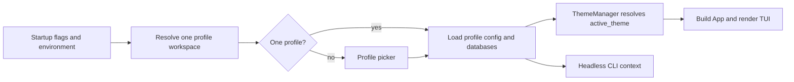

# Themes and Isolated Profiles

Consult this page when changing appearance configuration, theme parsing, profile startup, migration, or any path derived from a profile name. The two features share a critical boundary: the active profile owns the settings and data that the running `App` consumes.

## Runtime themes

`ThemeManager` (`src/theme/manager.rs`) resolves the saved `appearance.active_theme` ID through the theme registry. Built-ins (`default`, `summer`, `aqua`, `fire`, and `high-contrast`) are embedded; user themes are loaded from `~/.config/sshub/themes/*.toml` (or the profile-aware themes directory). Resolution layers palette, semantic slots, component roles, and static gradients over `default`. `pty_background` and `pty_foreground` are resolved as a pair for the embedded remote grid; remote-selected colors remain untouched.

The picker (`src/tui/screens/theme_picker.rs`) previews the whole interface while moving, reloads with `r`, rolls back on `Esc`, and persists only on `Enter`. Invalid files remain listed with their parse/validation reason, and unknown roles produce a warning rather than making an otherwise usable theme unusable. `sshub theme check|list|show` uses the headless parser and does not open the TUI or databases; `show --resolved` emits a self-contained resolved document.

Transparency is represented by two independent booleans: `appearance.transparent_sshub_background` releases application surfaces, while `appearance.transparent_session_background` releases the remote grid. Both default to opaque; selection, borders, and status styles remain visible. The obsolete `opaque_background` setting is ignored.

## Profiles and lifecycle

`ProfilePaths` and `resolve_profile_workspace` (`src/profile/mod.rs`) select one workspace before `App` construction. Normal mode stores `state.toml` plus `profiles/<name>/`; each profile owns `launcher.db`, `metadata.db`, `config.toml`, fallback credentials, session logs, and tunnel state. One profile starts without prompting; multiple profiles show the picker. `--profile NAME` selects directly and `--manage-profiles` forces management. `SSHUB_DATA_DIR` or `SSHUB_CONFIG_DIR` selects compatibility mode and bypasses profile discovery.

Legacy top-level data is migrated by `src/profile/migrate.rs` into `profiles/default` before the new state file is committed. Profile names are validated before being joined to the profiles directory, and deletion uses staging/rename steps so an interrupted operation does not leave a half-published state. Headless commands use the last-used profile and never open the picker.

*Profile selection precedes configuration/theme loading and `App` construction.*

## Change guidance

- Add a theme field through the model/parser/validator/resolver chain, then update the built-in or role catalogue only at its canonical source; do not hand-edit generated role snapshots. Test parser diagnostics, inheritance, unknown-role warnings, picker preview/rollback, and persistence through the real `Enter` path.
- Change profile storage in `ProfilePaths` and migration together. Check compatibility-mode behavior, path traversal rejection, startup selection, rename/delete recovery, and last-used selection.
- Focused checks: `cargo test --test e2e theme_picker`; `cargo test theme`; `cargo test profile`. Run the package/release build only when changing embedded assets, publish packaging, or release profile behavior.

Themes are rendered by the [TUI dashboard](tui.md), while profile-owned databases and settings are described in the [data model](../architecture/data-model.md). Credentials and fallback files follow the [secrets policy](../security/secrets.md).
