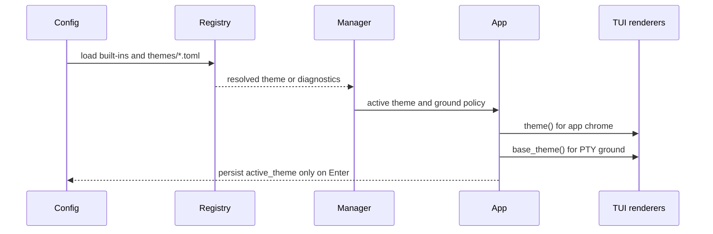

# Runtime Themes and Appearance

Consult this page when changing colors, popup rendering, transparency, the theme picker, or the `sshub theme` command. The implementation separates authored TOML definitions from immutable resolved themes: `src/theme/parse.rs` and `src/theme/validate.rs` parse and diagnose files, `src/theme/resolve.rs` applies inheritance, and `src/theme/manager.rs` owns the active theme used by `App`.

## Theme sources and resolution

User themes are top-level `*.toml` files in `~/.config/sshub/themes/`; the filename is the ID. A theme can define a `[palette]`, 25-slot `[semantic]` core, per-role `[components]`, and named `[gradients]`. Unspecified values inherit from `default`. Five built-ins are embedded in `assets/themes/`: `default`, `summer`, `aqua`, `fire`, and `high-contrast`. The catalog in `src/theme/catalog.rs` is the source for the generated role guide in `docs/theme-system.md`; it covers 234 renderer roles.

`ThemeRegistry` isolates bad files: invalid themes remain visible with diagnostics, while a missing or unusable `appearance.active_theme` falls back to `default` and leaves the configured ID intact so repairing the file restores the choice. Compatible runtime loading permits forward-compatible unknown roles as warnings; strict validation is used by `theme check`.

## Picker and persistence

Settings opens the picker from `Ctrl+H` → Theme. `App::open_theme_picker` snapshots the original resolved theme. Selection previews the whole interface; invalid rows remain listed but cannot be activated, `r` reloads the directory, `Esc` restores the snapshot, and only `Enter` calls the config writer to persist `appearance.active_theme`. Theme activation invalidates visual snapshots so old-theme cells are not reused by transitions.

## Transparency and the embedded PTY

SSHub is opaque by default. `appearance.transparent_sshub_background` releases SSHub's app ground, while `appearance.transparent_session_background` releases the remote grid; they are independent and do not remove selection bars, borders, status colors, or other foreground chrome. `opaque_background` is obsolete and ignored. ANSI provides no alpha slider, so transparency means leaving background cells for the terminal emulator.

The semantic `pty_background` and `pty_foreground` slots color the embedded grid's default ground as a pair. Remote-selected colors remain untouched. App surfaces and gradients are painted by `src/theme/gradient.rs` and `src/tui/blit.rs`, never over the remote grid.

This is the theme lifecycle from startup through rendering and picker commit.

## Headless CLI

`src/main.rs` dispatches `theme` before database bootstrap. `src/cli/theme.rs` implements:

- `sshub theme check FILE [--format plain|json]`: strict, source-span diagnostics with suggestions.
- `sshub theme list [--format plain|json]`: built-ins, installed themes, invalid rows, and directory diagnostics.
- `sshub theme show ID [--resolved] [--format toml|json]`: source or a standalone resolved export that reparses to the same theme.

These commands do not open the TUI or database. Public behavior is covered by `tests/smoke/theme_public_api.rs`; picker behavior is covered by `tests/e2e/theme_picker.rs` and `src/app/tests/theme_picker.rs`.

## Change guidance

For a new role, update the catalog and canonical theme assets, regenerate the role section of `docs/theme-system.md` using the repository's ignored catalog test, update parity/renderer tests, then run the smoke and picker tests. For a new built-in, add its embedded asset in `src/theme/builtins.rs` and test resolution. Do not hand-edit generated role tables or recolor session cells in app-surface code.

Related concepts: [TUI dashboard](tui.md) dispatches the picker and settings overlay; [embedded sessions and SFTP](sessions-sftp.md) owns PTY rendering and explains the remote-grid boundary; [data model and storage](../architecture/data-model.md) explains profile-owned configuration.
